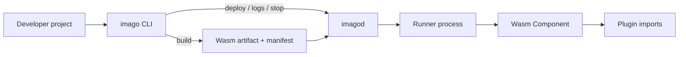
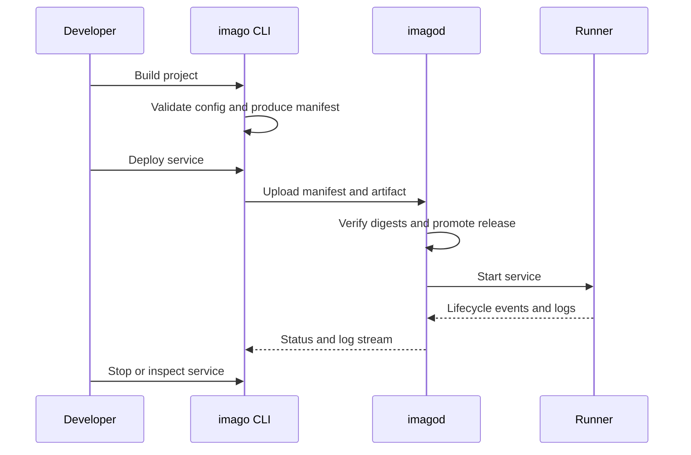

# imago

imago is a Wasm Component deployment and runtime platform for embedded Linux systems.
It is built for constrained environments where deployment needs to stay lightweight, capabilities must stay explicit, and remote operations need predictable control paths.
The deployable unit is a Wasm Component, while `imagod` provides the daemon-side runtime and supervision boundary.

imago is under active development and is currently intended for private-network use.

## What Is Imago?

imago gives you a consistent path from project configuration to deployed Wasm service:

- Build a Wasm Component from an application project
- Declare capabilities and target settings in config
- Deploy to a local or remote `imagod`
- Start, stop, inspect, and stream logs through the same control surface

If you want the shortest path to a running example, start with [QUICKSTART.md](QUICKSTART.md).

## Why imago

- Lightweight runtime footprint for embedded Linux targets
- Explicit capability boundaries instead of implicit host access
- Predictable deploy and operate workflow through `imago` and `imagod`
- Multiple execution models for one-shot, HTTP, socket, and RPC services

## System Overview



The CLI is responsible for build, packaging, deployment requests, and operator-facing commands.
`imagod` validates artifacts, manages lifecycle, and launches isolated runners for the component.

## How Deployment Flows



This keeps the operator workflow stable even when the target is remote: build locally, send a validated artifact set, then operate the service through the daemon boundary.

## Execution Modes

| Mode | Use case | Where to read more |
| --- | --- | --- |
| `cli` | One-shot command execution | [Architecture](docs/architecture.md) |
| `http` | Long-running HTTP ingress service | [examples/local-imagod-http](examples/local-imagod-http/README.md) |
| `socket` | Socket-oriented service with protocol constraints | [examples/local-imagod-socket](examples/local-imagod-socket/README.md) |
| `rpc` | Resident service invoked through RPC calls | [Network RPC](docs/network-rpc.md) |

## Quick Start Path

Choose the path that matches what you want to do:

### Start from a fresh template

1. Install `imago` and `imagod`.
   - Run the two installer commands in [QUICKSTART.md](QUICKSTART.md).
2. Create a new project and move into it.

   ```bash
   imago project init app --template rust
   cd app
   ```

3. Continue with [QUICKSTART.md](QUICKSTART.md) for the remaining setup.
   - It covers the `wasm32-wasip2` target, local key generation, SSH-only target config, `imagod.toml`, manual daemon startup, and the first deploy.

The bare `rust` template creates the application files only (`Cargo.toml`, `imago.toml`, and `src/main.rs`).
It does not include `imagod.toml` or the local key material needed to start `imagod`.

### Try a checked-in sample

For the shortest runnable path from this repository, use [examples/local-imagod/README.md](examples/local-imagod/README.md).

```bash
# Terminal 1
cd examples/local-imagod
cargo run -p imagod -- --config imagod.toml
```

```bash
# Terminal 2
cd examples/local-imagod
# Run this after Terminal 1 has started imagod
cargo run -p imago-cli -- service deploy --target default --detach
cargo run -p imago-cli -- service logs local-imagod-app --tail 200
```

If you omit `[target.default]` from `imago.toml`, pass the remote directly instead:

```bash
cargo run -p imago-cli -- service deploy --target ssh://localhost?socket=/tmp/imagod-local.sock --detach
cargo run -p imago-cli -- service logs local-imagod-app --target ssh://localhost?socket=/tmp/imagod-local.sock --tail 200
```

For more sample projects, browse [examples/README.md](examples/README.md).

## Examples And Docs

| Need | Start here |
| --- | --- |
| Documentation landing page | [docs/README.md](docs/README.md) |
| High-level architecture | [docs/architecture.md](docs/architecture.md) |
| Project config reference | [docs/imago-configuration.md](docs/imago-configuration.md) |
| Daemon config reference | [docs/imagod-configuration.md](docs/imagod-configuration.md) |
| RPC control path | [docs/network-rpc.md](docs/network-rpc.md) |
| Runnable examples | [examples/README.md](examples/README.md) |

## Repository Layout

This repository is a Rust workspace with a few clear boundaries:

| Path | Purpose |
| --- | --- |
| `crates/` | Core CLI, protocol, daemon, runtime, config, and support crates |
| `plugins/` | Built-in plugin implementations and WIT packages |
| `examples/` | Local example projects for common execution models and plugin usage |
| `e2e/` | End-to-end test assets and scenarios |

## Source Of Truth

Normative behavior lives in the codebase and its tests, with user-facing explanations in `docs/`.
Useful entry points:

- Build and manifest rules: [`crates/imago-cli/src/commands/build/mod.rs`](crates/imago-cli/src/commands/build/mod.rs)
- Dependency and lock resolution: [`crates/imago-cli/src/commands/update/mod.rs`](crates/imago-cli/src/commands/update/mod.rs)
- Wire contracts: [`crates/imago-protocol/src/lib.rs`](crates/imago-protocol/src/lib.rs)
- Daemon orchestration: [`crates/imagod-control/src/orchestrator.rs`](crates/imagod-control/src/orchestrator.rs)

Generated API docs:

```bash
cargo doc --workspace --no-deps
```

## Development

```bash
cargo fmt --all
cargo clippy --workspace --all-targets -- -D warnings
cargo test --workspace
```

## Community

- [Contributing](CONTRIBUTING.md)
- [Code of Conduct](CODE_OF_CONDUCT.md)
- [Security Policy](SECURITY.md)

## License

Apache-2.0
