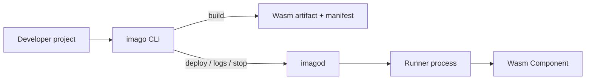

# imago Book

This book is the smallest stable entry point for writing and previewing `imago` documentation with `mdBook`.
It keeps the initial surface small: one landing page and one quickstart page, while the rest of the repository remains source-of-truth.

## Start Here

- Use [Quickstart](quickstart.md) for the shortest path from install to first deploy.
- Keep normative behavior in code docs, type definitions, validation logic, and tests under `crates/`.
- Keep user-facing reference material in the repository `docs/` directory until it is intentionally migrated into this book.

## Local Authoring

```bash
mdbook serve book
```

Use `mdbook build book` when you want the same build step that CI runs.

## Runtime Overview



## Repository References

Detailed reference pages still live in the repository `docs/` directory, such as:

- `docs/architecture.md`
- `docs/imago-configuration.md`
- `docs/imagod-configuration.md`
- `docs/network-rpc.md`
