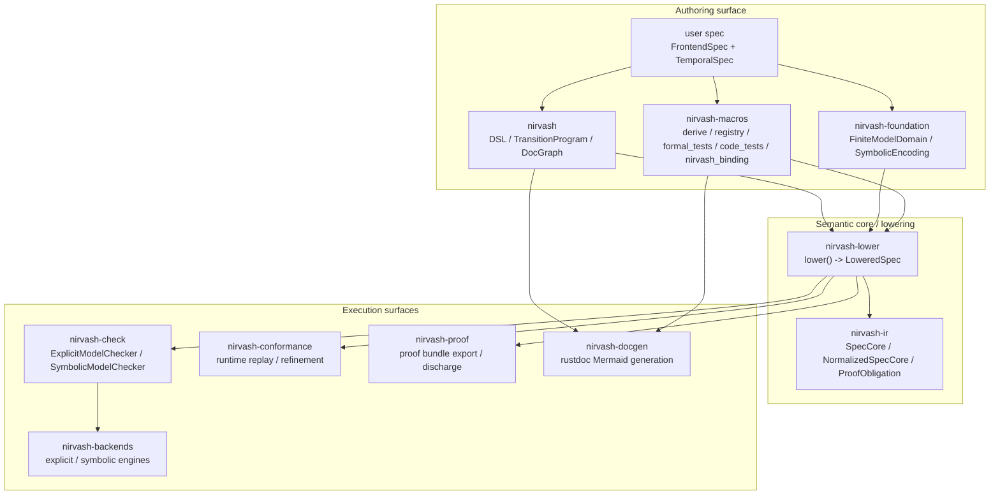
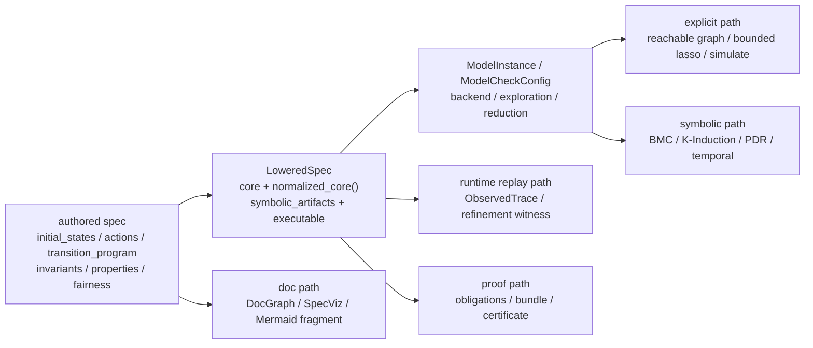

# nirvash

`nirvash` は `imago` workspace の formal frontend DSL です。  
authoring surface は引き続き `pred!` / `step!` / `ltl!` / `TransitionProgram` を中心に保ちつつ、checker-facing な semantic core / lowering / conformance / proof export は sibling crate へ分離されました。

## 現在のシステム全体像

現在の `nirvash` system は、大きく分けると次の 3 層です。

- authoring surface
  - `nirvash` / `nirvash-foundation` / `nirvash-macros` で spec を Rust と DSL で記述する層
- semantic core / lowering
  - `nirvash-lower` が authored spec を `LoweredSpec` と `SpecCore` へ落とし込む層
- execution surfaces
  - `nirvash-check` / `nirvash-backends` / `nirvash-conformance` / `nirvash-proof` / `nirvash-docgen` が lower 後の spec を消費する層



`nirvash` root crate は「spec を書く側」の入口で、`nirvash-lower` がその authored semantics を checker-facing な `LoweredSpec` へ変換します。
その後、checker は `nirvash-check`、runtime との照合は `nirvash-conformance`、証明 artifact 生成は `nirvash-proof`、可視化は `nirvash-docgen` が担います。

## 1 つの spec が通る経路

`nirvash` の current path は「書く -> lower する -> 実行 surface を選ぶ」です。`LoweredSpec` が各 surface の共通境界になっています。



- authored spec の正本
  - `FrontendSpec` / `TemporalSpec` 実装と `TransitionProgram`
- checker-facing contract の正本
  - `nirvash_lower::LoweredSpec`
- symbolic / proof の意味論正本
  - `LoweredSpec::normalized_core()`
- runtime refinement の正本
  - `nirvash-conformance` の `ObservedTrace`, `TraceRefinementMap`, `step_refines_relation`
- docs 可視化の正本
  - `DocGraph` / `SpecViz` provider 登録と `nirvash-docgen`

## Crate split

- `nirvash`
  - DSL / transition frontend / doc graph shared type
- `nirvash-foundation`
  - `FiniteModelDomain` / `SymbolicEncoding` / symbolic state schema の基底 trait と helper
- `nirvash-macros`
  - derive / registry / `formal_tests` / import-first `code_tests` / `nirvash_binding` / subsystem registration
- `nirvash-ir`
  - backend 非依存の `SpecCore`, `StateExpr`, `ActionExpr`, `TemporalExpr`, `FairnessDecl`
- `nirvash-lower`
  - `FrontendSpec`, `LoweredSpec`, `FiniteModelDomain`, `SymbolicEncoding`, checker-facing config/model boundary
- `nirvash-check`
  - `ExplicitModelChecker` / `SymbolicModelChecker` の typed checker front door
- `nirvash-backends`
  - explicit / symbolic backend 実装（`LoweredSpec` を受ける）
- `nirvash-conformance`
  - `SpecOracle` / runtime binding / generated harness plan / replay artifact / `proptest` / `loom` / `kani` adapter
- `nirvash-proof`
  - `ProofBundleExporter` / `ProofDischarger` / certificate importer
- `nirvash-docgen`
  - rustdoc 向けの Mermaid fragment / doc graph / spec viz 生成
- `cargo-nirvash`
  - `target/nirvash/{manifest,replay}` と `tests/generated/*_{replay,kani}.rs` を扱う CLI (`list-tests` / `materialize-tests` / `replay`)

通常の runtime crate は引き続き `nirvash` を起点に authoring できますが、checker / conformance / proof 側は `nirvash-lower` / `nirvash-conformance` / `nirvash-proof` を明示的に参照します。`LoweredSpec` は `core` に加えて `normalized_core()` を公開し、symbolic backend と proof export はこの正規化済み core を意味論の正本として参照します。`z3` は `nirvash-backends` の通常依存として formal stack に常設されますが、`imagod` の通常依存木には入れません。

現状の backend semantics は次のとおりです。

- `ModelBackend::Explicit + ExplorationMode::ReachableGraph`
  - `ExplicitModelCheckOptions::current()` に対応する exact in-memory BFS reachable graph
- `ModelBackend::Explicit + ExplorationMode::BoundedLasso`
  - `ExplicitModelCheckOptions::current()` に対応する explicit bounded prefix / lasso enumeration
- `ModelBackend::Symbolic + ExplorationMode::ReachableGraph`
  - `TransitionProgram` / `SpecCore` / `SymbolicEncoding` を使う direct SMT safety path。`safety = Bmc | KInduction | PdrIc3` を正本にし、reachable-graph snapshot は relational bridge に限定
- `ModelBackend::Symbolic + ExplorationMode::BoundedLasso`
  - `temporal = BoundedLasso | LivenessToSafety` に対応する direct SMT temporal path

symbolic backend は AST-native DSL を要求し、legacy closure path や未登録 helper / effect は fail-closed します。schema validation は direct field read だけでなく pure call の receiver / argument read path、property、fairness にも掛かり、state schema には sort metadata も保持されます。
explicit backend は exact state equality ベースの symmetry canonicalization を使い、temporal property / fairness と併用できます。
AST-native surface には arithmetic minimum set、projection/payload access、set operator、structural quantification/comprehension、bounded choice、immutable aggregate update が入り、update 側では `nirvash::sequence_update` / `nirvash::function_update` と Rust の struct update syntax をそのまま使えます。

`ModelCheckConfig` は共通 knob に加えて backend-specific option を持ちます。

- 共通 knob
  - `counterexample_minimization = None | ShortestTrace` で first-hit と shortest-trace 優先を切り替えます
- `explicit: ExplicitModelCheckOptions`
  - 現時点では `state_storage = InMemoryExact | InMemoryFingerprinted`、`compression = None | DomainIndex`、`reachability = BreadthFirst | ParallelFrontier | DistributedFrontier`、`bounded_lasso = EnumeratedPaths`
  - `checkpoint = ExplicitCheckpointOptions { path, save_every_frontiers, resume }` で reachable-graph frontier checkpoint/save-resume を設定
  - `parallel = ExplicitParallelOptions { workers }` と `distributed = ExplicitDistributedOptions { shards }` で explicit reachable-graph frontier の local/distributed wave を設定
  - `simulation = ExplicitSimulationOptions { runs: 1, max_depth: 32, seed: 0 }` で `ExplicitModelChecker::simulate()` の deterministic random walk を設定
- `ModelInstance::with_claimed_reduction(ClaimedReduction)` で claim-based symmetry / quotient / POR を付け、`ModelInstance::with_certified_reduction(CertifiedReduction)` で certificate-based reduction を付ける。`ModelInstance::with_heuristic_reduction(HeuristicReduction)` は state projection / action pruning を付ける
- `ModelCheckResult` / `ReachableGraphSnapshot` / `DocGraphCase` は `TrustTier = Exact | CertifiedReduction | ClaimedReduction | Heuristic` を持つ
- `symbolic: SymbolicModelCheckOptions`
  - 現時点では `bridge = RelationalBridgeOptions { strategy = SolverEnumeration }`、`temporal = BoundedLasso | LivenessToSafety`、`safety = Bmc | KInduction | PdrIc3`
  - `k_induction = SymbolicKInductionOptions { max_depth }` と `pdr = SymbolicPdrOptions { max_frames }` で invariant proof engine の bound を設定

これらは current implementation を present tense で表す public contract です。symbolic backend は heuristic reduction、claimed/certified reduction、unsupported normalized fragment を fail-closed し、explicit backend は checkpoint / parallel / distributed / simulation / compression と reduction tier を同じ config surface で切り替えます。
`nirvash-check` は backend 固定の `ExplicitModelChecker` / `SymbolicModelChecker` を正本とします。symbolic-only 利用では `FiniteModelDomain` を持たない state でも lower した `LoweredSpec` を `SymbolicModelChecker` に直接渡せます。

## What It Provides

- `FiniteModelDomain`: bounded helper 型へ finite domain と値 invariant を与える checker-facing trait
- `SymbolicEncoding`: symbolic sort / state schema を与える checker-facing trait
- `ExplicitModelChecker` / `SymbolicModelChecker`: typed checker front door (`nirvash-check`)
- `RelAtom` / `RelSet<T>` / `Relation2<A, B>`: relational kernel
- `TransitionProgram`: frontend DSL の遷移記述 surface
- `FrontendSpec` / `LoweredSpec`: backend へ渡る lowering boundary
- `TemporalSpec`: property / core fairness provider
- `Ltl`: `[]`, `<>`, `X`, `U`, `ENABLED`, `~>` を含む Rust DSL
- `SpecOracle` / `RuntimeBinding` / `TraceBinding` / `ConcurrentBinding`: runtime conformance contract (`nirvash-conformance`)
- `pred!` / `step!` / `ltl!` と registry macro

## Generated Code Tests

新しい code test surface は spec item と binding impl を分けて宣言します。

- spec 側
  - `#[code_tests]` を `struct Spec;` / `enum Spec` / `type Spec = ...;` に付ける
  - spec 自体は `FrontendSpec + TemporalSpec + SpecOracle` を実装する
- runtime 側
  - `#[nirvash_binding(spec = Spec)]` を `impl Binding { ... }` に付ける
  - method 単位で `#[nirvash(create)]`, `#[nirvash(action = ...)]`, `#[nirvash_fixture]`, `#[nirvash_project]`, `#[nirvash_project_output]`, `#[nirvash_trace]` を使う
- canonical installer
  - `nirvash::import_generated_tests! { spec = Spec, binding = Binding }` を使う
  - profile を絞るときは `nirvash::import_generated_tests! { spec = Spec, binding = Binding, profiles = [generated::profiles::unit_default().with_seeds(generated::seeds::boundary().with_strategy::<u64, _>(proptest::sample::select(vec![0, 1, 255, 256])).with_initial_state(State::Idle))] }`
  - reusable な typed seed は `nirvash_conformance::register_seed_strategy::<T, _, _>(|| strategy)` で登録でき、`FiniteModelDomain -> BoundaryCatalog -> registered Strategy -> deterministic Arbitrary -> Default -> singleton fallback` の順で自動 seed に取り込まれる
  - 手早い override は `small_keys(["a", "b"])`, `boundary_numbers::<u64>()`, `smoke_fixture(MyRuntime::default())` を `with(...)` に渡せる
- generated module
  - `generated::{prelude, metadata, seeds, profiles, plans, install, replay, bindings}` が生える
  - `generated::install::{all_tests!, tests!, unit_tests!, trace_tests!, kani_harnesses!, loom_tests!}` は low-level API として残る。spec が nested module 配下にある場合も full spec path に追従するので、crate root から直接使うときは `pub use nested_spec::generated;` のように `generated` を re-export してから呼ぶ
  - `generated::install::loom_tests!` は常に test 関数を生成し、consumer crate 側で `loom` feature を定義していない場合でも `nirvash-conformance` の serial fallback で実行できる

runtime artifact は `target/nirvash/{manifest,replay}` に保存され、materialized replay / Kani harness は `tests/generated/*_replay.rs` と `tests/generated/*_kani.rs` に出力されます。`cargo nirvash list-tests`, `cargo nirvash materialize-tests`, `cargo nirvash replay` で扱えます。

## Minimal Example

```rust
use nirvash::TransitionProgram;
use nirvash_check as checks;
use nirvash_lower::{FrontendSpec, TemporalSpec};
use nirvash_macros::{
    FiniteModelDomain as FormalFiniteModelDomain,
    SymbolicEncoding as FormalSymbolicEncoding,
    nirvash_expr, nirvash_transition_program,
};

#[derive(Clone, Copy, Debug, PartialEq, Eq, FormalFiniteModelDomain, FormalSymbolicEncoding)]
enum State {
    Idle,
    Busy,
}

#[derive(Clone, Copy, Debug, PartialEq, Eq, FormalFiniteModelDomain, FormalSymbolicEncoding)]
enum Action {
    Start,
    Finish,
}

#[derive(Default)]
struct Spec;

impl FrontendSpec for Spec {
    type State = State;
    type Action = Action;

    fn frontend_name(&self) -> &'static str {
        "Spec"
    }

    fn initial_states(&self) -> Vec<Self::State> {
        vec![State::Idle]
    }

    fn actions(&self) -> Vec<Self::Action> {
        vec![Action::Start, Action::Finish]
    }

    fn transition_program(&self) -> Option<TransitionProgram<Self::State, Self::Action>> {
        Some(nirvash_transition_program! {
            rule start when matches!(action, Action::Start) && matches!(prev, State::Idle) => {
                set self <= State::Busy;
            }

            rule finish when matches!(action, Action::Finish) && matches!(prev, State::Busy) => {
                set self <= State::Idle;
            }
        })
    }
}

impl TemporalSpec for Spec {
    fn invariants(&self) -> Vec<nirvash::BoolExpr<Self::State>> {
        vec![nirvash_expr!(declared_states_are_valid(state) => matches!(state, State::Idle | State::Busy))]
    }
}

let spec = Spec::default();
let mut lowering_cx = nirvash_lower::LoweringCx;
let lowered = spec.lower(&mut lowering_cx).expect("spec lowers");
let result = checks::ExplicitModelChecker::new(&lowered)
    .check_all()
    .expect("checker runs");
assert!(result.is_ok());
```
