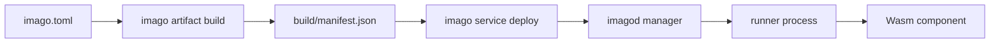

# Imago Documentation

Imago is a Wasm Component deployment and runtime platform for embedded Linux environments.
This documentation is organized for quick onboarding first, then direct source references for normative behavior.

## Basics

- [Architecture](./architecture.md)
- [imago.toml Reference](./imago-configuration.md)
- [imagod.toml Reference](./imagod-configuration.md)
- [CLI Output Contract](./cli-output-contract.md)



## Further Reading

- [Network RPC Model](./network-rpc.md)
- [WIT Plugins](./wit-plugins.md)

## Release Flow Contract

- リリースは `prup` + custom GitHub Action の2段運用です。
  - `prup`: 差分計算・version更新計画・`Cargo.toml` / root `Cargo.lock` 同期を担当します。
  - `.github/actions/prup-release-pr`: top crate ごとの release PR 作成（branch/push/PR）を担当します。
  - `.github/actions/prup-release`: tag / GitHub Release 作成を担当します。
- `prup apply` は plan 適用時に root `Cargo.lock` も同期します。
  release bump PR には `Cargo.toml` だけでなく `Cargo.lock` の差分も必ず含まれます。
- 設定の source-of-truth は root `Cargo.toml` の `[workspace.metadata.prup]` です。
- `[workspace.metadata.prup.crates]` は top crate のみを手動定義します。
  内部 crate は `cargo metadata` の依存グラフから自動検出されます。
- release PR の GitHub label は `[workspace.metadata.prup.github.release_pr]` で管理します。
  imago では `labels = ["release"]` を設定し、release PR に自動付与します。
- 自動所属判定に使う依存種別は `dependency_kinds = ["normal", "build", "dev"]` です。
- タグは `prup` が生成し、以下のバージョン契約に従います。
  - `imago-vX.Y.Z` / `imago-vX.Y.Z-alpha(.N)` / `imago-vX.Y.Z-beta(.N)`:
    `crates/imago-cli/Cargo.toml` の `version`。
  - `imagod-vX.Y.Z` / `imagod-vX.Y.Z-alpha(.N)` / `imagod-vX.Y.Z-beta(.N)`:
    ルート `Cargo.toml` の `[workspace.package].version`。
- `prup` の line 管理は以下の3グループです。
  - `imagod-daemon`: `imagod`、`imagod-*`、`imago-plugin-macros`、`imago-plugin-imago-*`
  - `imago-cli`: `imago-cli`
  - `imago-shared`: `imago-protocol`
- `imago-protocol` のように `imagod`/`imago-cli` の双方で使う crate は
  二重所属せず `shared_line = "imago-shared"` へ自動集約し、`propagate_to` で波及させます。
  `shared_line` 未設定で overlap が出た場合、`prup doctor` / `prup plan` は fail-closed で停止します。
- タグ生成対象は top crate のみです。
  - `imago-cli` -> `imago-vX.Y.Z`
  - `imagod` -> `imagod-vX.Y.Z`
- release PR は top crate / release line ごとに 1 本作られます。
  - branch: `codex/prup-release-<line-id>`
  - title: `ci(release): <crate> <before> -> <after>`
  - body: bump level, tag diff, updated crates, propagated lines を自動生成
- 内部 crate はタグ不要で、top crate の最新タグから `HEAD` までの差分計算で line へ連動します。
- `imago-cli` 専用の内部 crate は impact-only として扱い、`imagod` の workspace version は不用意に bump しません。
- daemon 閉包外の依存 crate は内部依存として扱い、`publish = false` / `release = false` を維持します。
- baseline tag の必須対象は top crate (`imago-cli` / `imagod`) のみです。
  未タグの top crate があると `prup doctor` / `prup plan` は fail-closed で停止します。
- crates.io への実 publish（`cargo publish`）は実行しません。
- GitHub Release は stable / alpha / beta を問わず常に prerelease として作成されます。
- release workflow では `RELEASE_PLZ_TOKEN`（GitHub 操作用）を利用し、custom action 内で `gh` CLI を呼び出します。
- バイナリ添付は `imago-build.yml` が `release` イベントで既存Releaseへ追加します。
  - `imagod-v*` では `imagod-<target-triple>` と `imagod-<target-triple>.sha256` が添付されます。
  - target には Linux 系（gnu/musl）に加えて `x86_64-apple-darwin` / `aarch64-apple-darwin` も含まれます。
- `scripts/install_imagod.sh` は上記 release asset を利用して `imagod` を自動導入します。
  - タグ解決優先順: `--tag` > `git ls-remote` で最新 `imagod-v*`（GitHub API の JSON 解析はしない）
  - 対応OS: Linux / macOS（Darwin）
  - target 解決: `--target <triple>`（指定時） > 自動判定（未指定時）
  - `--libc` は廃止（breaking change）され、受け付けません
  - サービス導入優先順: Linux は `systemd` > `init.d` > binary-only、macOS は `launchd(system daemon)` > binary-only
  - private release へアクセスする場合は `GH_TOKEN` を利用します。

## Source Of Truth (Code)

The source of truth is the codebase (module docs, type definitions, validation logic, and tests).

- Build and manifest normalization:
  - [`crates/imago-cli/src/commands/build/mod.rs`](../crates/imago-cli/src/commands/build/mod.rs)
  - [`crates/imago-cli/src/commands/build/validation.rs`](../crates/imago-cli/src/commands/build/validation.rs)
- Dependency and lock resolution:
  - [`crates/imago-cli/src/commands/update/mod.rs`](../crates/imago-cli/src/commands/update/mod.rs)
  - [`crates/imago-cli/src/lockfile/mod.rs`](../crates/imago-cli/src/lockfile/mod.rs)
  - [`crates/imago-cli/src/lockfile/resolve.rs`](../crates/imago-cli/src/lockfile/resolve.rs)
- Protocol contracts and validation:
  - [`crates/imago-protocol/src/lib.rs`](../crates/imago-protocol/src/lib.rs)
  - [`crates/imago-protocol/src/messages`](../crates/imago-protocol/src/messages)
- Daemon configuration and runtime orchestration:
  - [`crates/imagod-config/src/lib.rs`](../crates/imagod-config/src/lib.rs)
  - [`crates/imagod-config/src/load/validation.rs`](../crates/imagod-config/src/load/validation.rs)
  - [`crates/imagod-server/src/protocol_handler.rs`](../crates/imagod-server/src/protocol_handler.rs)
  - [`crates/imagod-control/src/orchestrator.rs`](../crates/imagod-control/src/orchestrator.rs)
  - [`crates/imagod-control/src/service_supervisor.rs`](../crates/imagod-control/src/service_supervisor.rs)

For generated API docs:

```bash
cargo doc --workspace --no-deps
```
