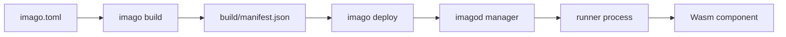

# Imago Documentation

Imago is a Wasm Component deployment and runtime platform for embedded Linux environments.
This documentation is organized for quick onboarding first, then direct source references for normative behavior.

## Basics

- [Architecture](./architecture.md)
- [imago.toml Reference](./imago-configuration.md)
- [imagod.toml Reference](./imagod-configuration.md)



## Further Reading

- [Network RPC Model](./network-rpc.md)
- [WIT Plugins](./wit-plugins.md)

## Source Of Truth (Code)

The source of truth is the codebase (module docs, type definitions, validation logic, and tests).

- Build and manifest normalization:
  - [`crates/imago-cli/src/commands/build/mod.rs`](../crates/imago-cli/src/commands/build/mod.rs)
  - [`crates/imago-cli/src/commands/build/validation.rs`](../crates/imago-cli/src/commands/build/validation.rs)
- Dependency and lock resolution:
  - [`crates/imago-cli/src/commands/update/mod.rs`](../crates/imago-cli/src/commands/update/mod.rs)
  - [`crates/imago-lockfile/src/lib.rs`](../crates/imago-lockfile/src/lib.rs)
  - [`crates/imago-lockfile/src/resolve.rs`](../crates/imago-lockfile/src/resolve.rs)
- Protocol contracts and validation:
  - [`crates/imago-protocol/src/lib.rs`](../crates/imago-protocol/src/lib.rs)
  - [`crates/imago-protocol/src/messages`](../crates/imago-protocol/src/messages)
- Daemon configuration and runtime orchestration:
  - [`crates/imagod-config/src/lib.rs`](../crates/imagod-config/src/lib.rs)
  - [`crates/imagod-config/src/load/validation.rs`](../crates/imagod-config/src/load/validation.rs)
  - [`crates/imagod-server/src/protocol_handler.rs`](../crates/imagod-server/src/protocol_handler.rs)
  - [`crates/imagod-control/src/orchestrator.rs`](../crates/imagod-control/src/orchestrator.rs)
  - [`crates/imagod-control/src/service_supervisor.rs`](../crates/imagod-control/src/service_supervisor.rs)

For generated API docs:

```bash
cargo doc --workspace --no-deps
```
