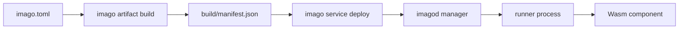

# Imago Documentation

Imago is a Wasm Component deployment and runtime platform for embedded Linux environments.
This documentation is organized for quick onboarding first, then direct source references for normative behavior.

## Basics

- [Architecture](./architecture.md)
- [imago.toml Reference](./imago-configuration.md)
- [imagod.toml Reference](./imagod-configuration.md)
- [CLI Output Contract](./cli-output-contract.md)



## Further Reading

- [Network RPC Model](./network-rpc.md)
- [WIT Plugins](./wit-plugins.md)

## Release Flow Contract

- リリースは `release-plz` の2段運用です。
  - `release-plz release-pr`: version 更新を含むリリースPRを作成します。
  - `release-plz release`: マージ済みリリースPRに対してタグと GitHub Release を作成します。
- タグは `release-plz` が生成し、以下のバージョン契約に従います。
  - `imago-vX.Y.Z` / `imago-vX.Y.Z-alpha(.N)` / `imago-vX.Y.Z-beta(.N)`:
    `crates/imago-cli/Cargo.toml` の `version`。
  - `imagod-vX.Y.Z` / `imagod-vX.Y.Z-alpha(.N)` / `imagod-vX.Y.Z-beta(.N)`:
    ルート `Cargo.toml` の `[workspace.package].version`。
- GitHub Release は stable / alpha / beta を問わず常に prerelease として作成されます。
- release-plz workflow では `RELEASE_PLZ_TOKEN`（PAT）を利用します。
- バイナリ添付は `imago-build.yml` が `release` イベントで既存Releaseへ追加します。

## Source Of Truth (Code)

The source of truth is the codebase (module docs, type definitions, validation logic, and tests).

- Build and manifest normalization:
  - [`crates/imago-cli/src/commands/build/mod.rs`](../crates/imago-cli/src/commands/build/mod.rs)
  - [`crates/imago-cli/src/commands/build/validation.rs`](../crates/imago-cli/src/commands/build/validation.rs)
- Dependency and lock resolution:
  - [`crates/imago-cli/src/commands/update/mod.rs`](../crates/imago-cli/src/commands/update/mod.rs)
  - [`crates/imago-cli/src/lockfile/mod.rs`](../crates/imago-cli/src/lockfile/mod.rs)
  - [`crates/imago-cli/src/lockfile/resolve.rs`](../crates/imago-cli/src/lockfile/resolve.rs)
- Protocol contracts and validation:
  - [`crates/imago-protocol/src/lib.rs`](../crates/imago-protocol/src/lib.rs)
  - [`crates/imago-protocol/src/messages`](../crates/imago-protocol/src/messages)
- Daemon configuration and runtime orchestration:
  - [`crates/imagod-config/src/lib.rs`](../crates/imagod-config/src/lib.rs)
  - [`crates/imagod-config/src/load/validation.rs`](../crates/imagod-config/src/load/validation.rs)
  - [`crates/imagod-server/src/protocol_handler.rs`](../crates/imagod-server/src/protocol_handler.rs)
  - [`crates/imagod-control/src/orchestrator.rs`](../crates/imagod-control/src/orchestrator.rs)
  - [`crates/imagod-control/src/service_supervisor.rs`](../crates/imagod-control/src/service_supervisor.rs)

For generated API docs:

```bash
cargo doc --workspace --no-deps
```
