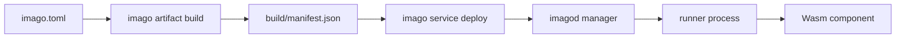

# Imago Documentation

Imago is a Wasm Component deployment and runtime platform for embedded Linux environments.
This documentation is organized for quick onboarding first, then direct source references for normative behavior.

## Basics

- [Architecture](./architecture.md)
- [imago.toml Reference](./imago-configuration.md)
- [imagod.toml Reference](./imagod-configuration.md)
- [CLI Output Contract](./cli-output-contract.md)



## Further Reading

- [Network RPC Model](./network-rpc.md)
- [WIT Plugins](./wit-plugins.md)

## Release Flow Contract

- リリースは `release-plz` の2段運用です。
  - `release-plz release-pr`: version 更新を含むリリースPRを作成します。
  - `release-plz release`: マージ済みリリースPRに対してタグと GitHub Release を作成します。
- タグは `release-plz` が生成し、以下のバージョン契約に従います。
  - `imago-vX.Y.Z` / `imago-vX.Y.Z-alpha(.N)` / `imago-vX.Y.Z-beta(.N)`:
    `crates/imago-cli/Cargo.toml` の `version`。
  - `imagod-vX.Y.Z` / `imagod-vX.Y.Z-alpha(.N)` / `imagod-vX.Y.Z-beta(.N)`:
    ルート `Cargo.toml` の `[workspace.package].version`。
- `git_only` のタグ基準は `imago-cli` / `imagod` に加えて daemon・shared の内部 crate を対象にします。
- `version_group` は以下の3グループで管理します。
  - `imagod-daemon`: `imagod`、`imagod-*`、`imago-plugin-macros`、`imago-plugin-imago-*`
  - `imago-cli`: `imago-cli`
  - `imago-shared`: `imago-protocol`
- `imago-protocol` のように `imagod`/`imago-cli` の双方で使う crate は
  二重所属せず `imago-shared` にのみ所属させます。
- daemon/shared の内部 crate は `tag-only` 運用です。
  - タグ形式は `<crate>-vX.Y.Z` です（`imagod` は `imagod-vX.Y.Z`）。
  - 内部 crate は `git_release_enable = false` / `changelog_update = false` を維持します。
- daemon 閉包外の依存 crate は内部依存として扱い、`publish = false` / `release = false` を維持します。
- 初回導入時は group 参加 crate へ baseline tag（最低1タグ）を事前に付与してください。
  未タグの crate があると `version_group` の次バージョン計算が進まず、連動 bump が発生しません。
- crates.io への実 publish（`cargo publish`）は実行しません。
- GitHub Release は stable / alpha / beta を問わず常に prerelease として作成されます。
- release-plz workflow では `RELEASE_PLZ_TOKEN`（GitHub 操作用）を利用します。
- release-plz 本体は fork の patch commit SHA を `cargo install --git --rev <sha>` で pin して導入します。
  - pin した SHA が参照できなくなった場合は fork の tag に退避して `--rev` を切り替えるか、upstream 正式リリースへ更新して pin を解除してください。
- バイナリ添付は `imago-build.yml` が `release` イベントで既存Releaseへ追加します。
  - `imagod-v*` では `imagod-<target-triple>` と `imagod-<target-triple>.sha256` が添付されます。
  - target には Linux 系（gnu/musl）に加えて `x86_64-apple-darwin` / `aarch64-apple-darwin` も含まれます。
- `scripts/install_imagod.sh` は上記 release asset を利用して `imagod` を自動導入します。
  - タグ解決優先順: `--tag` > `git ls-remote` で最新 `imagod-v*`（GitHub API の JSON 解析はしない）
  - 対応OS: Linux / macOS（Darwin）
  - target 解決: `--target <triple>`（指定時） > 自動判定（未指定時）
  - `--libc` は廃止（breaking change）され、受け付けません
  - サービス導入優先順: Linux は `systemd` > `init.d` > binary-only、macOS は `launchd(system daemon)` > binary-only
  - private release へアクセスする場合は `GH_TOKEN` を利用します。

## Source Of Truth (Code)

The source of truth is the codebase (module docs, type definitions, validation logic, and tests).

- Build and manifest normalization:
  - [`crates/imago-cli/src/commands/build/mod.rs`](../crates/imago-cli/src/commands/build/mod.rs)
  - [`crates/imago-cli/src/commands/build/validation.rs`](../crates/imago-cli/src/commands/build/validation.rs)
- Dependency and lock resolution:
  - [`crates/imago-cli/src/commands/update/mod.rs`](../crates/imago-cli/src/commands/update/mod.rs)
  - [`crates/imago-cli/src/lockfile/mod.rs`](../crates/imago-cli/src/lockfile/mod.rs)
  - [`crates/imago-cli/src/lockfile/resolve.rs`](../crates/imago-cli/src/lockfile/resolve.rs)
- Protocol contracts and validation:
  - [`crates/imago-protocol/src/lib.rs`](../crates/imago-protocol/src/lib.rs)
  - [`crates/imago-protocol/src/messages`](../crates/imago-protocol/src/messages)
- Daemon configuration and runtime orchestration:
  - [`crates/imagod-config/src/lib.rs`](../crates/imagod-config/src/lib.rs)
  - [`crates/imagod-config/src/load/validation.rs`](../crates/imagod-config/src/load/validation.rs)
  - [`crates/imagod-server/src/protocol_handler.rs`](../crates/imagod-server/src/protocol_handler.rs)
  - [`crates/imagod-control/src/orchestrator.rs`](../crates/imagod-control/src/orchestrator.rs)
  - [`crates/imagod-control/src/service_supervisor.rs`](../crates/imagod-control/src/service_supervisor.rs)

For generated API docs:

```bash
cargo doc --workspace --no-deps
```
