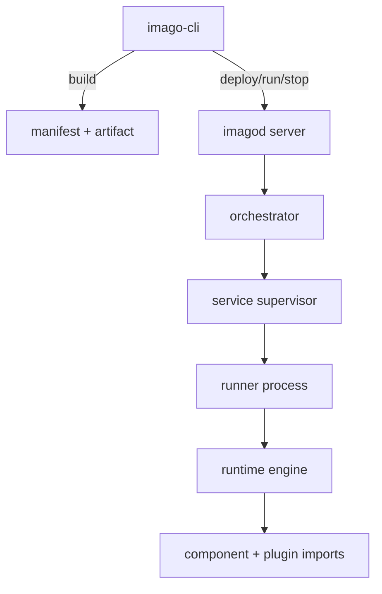

# Architecture

This page explains runtime and deployment architecture at a high level.
Normative behavior is defined by source modules and their tests.

## Goals

- Run the same Wasm component across heterogeneous embedded Linux targets.
- Keep permissions explicit with a capability-based model.
- Provide a predictable deploy workflow from CLI to daemon.

## System Model



## Execution Models

`imago.toml` supports these app types:

- `cli`: one-shot command execution.
- `http`: long-running ingress endpoint with request dispatch to component code.
- `socket`: network socket execution mode with protocol and direction constraints.
- `rpc`: resident service mode that executes exported functions on `rpc.invoke`.

## Security and Trust Boundaries

- Transport is QUIC + WebTransport.
- Authentication is raw public key (RPK) based.
- Server identity pinning uses TOFU through known-hosts state.
- Runtime permissions are enforced by capability rules in manifest data.

## Data Flow

1. `imago build` validates `imago.toml` and generates `build/manifest.json`.
2. `imago deploy` negotiates protocol limits and transfers artifacts.
3. `imagod` verifies digests, promotes release state, and launches a runner.
4. Runner executes the component and reports control-plane events.
5. Logs, status, and RPC invocations are served through protocol APIs.

## Performance Reproduction

Issue #227 (`runtime response body copy amplification`) has a reproducible perf check:

```bash
cargo test -p imagod-runtime-wasmtime http_response_perf_compare -- --ignored --nocapture --test-threads=1
```

This ignored test compares the legacy (`collect -> to_bytes -> to_vec`) path and the optimized frame-by-frame path with a fixed `32 MiB` single-frame workload (`64` iterations), and prints:

- `p99` latency in microseconds
- peak RSS in bytes (or `N/A` when unavailable on the platform)

## Source References

- Build/manifest: [`crates/imago-cli/src/commands/build/mod.rs`](../crates/imago-cli/src/commands/build/mod.rs)
- Protocol handler: [`crates/imagod-server/src/protocol_handler.rs`](../crates/imagod-server/src/protocol_handler.rs)
- Orchestration: [`crates/imagod-control/src/orchestrator.rs`](../crates/imagod-control/src/orchestrator.rs)
- Supervision: [`crates/imagod-control/src/service_supervisor.rs`](../crates/imagod-control/src/service_supervisor.rs)
- Runner bootstrap: [`crates/imagod-runtime/src/runner_process.rs`](../crates/imagod-runtime/src/runner_process.rs)
