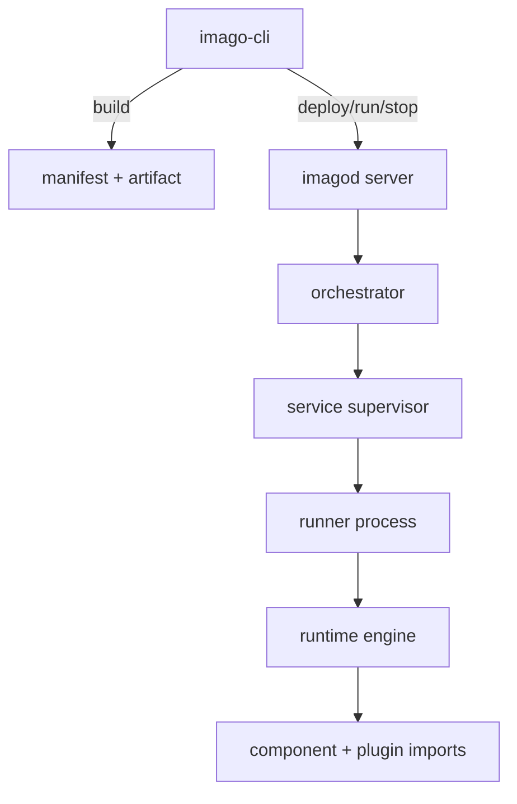

# Architecture

This page explains the runtime and deployment architecture at a high level.
For normative details, use [docs/spec](./spec/README.md).

## Goals

- Run the same Wasm component across heterogeneous embedded Linux targets.
- Keep permissions explicit with a capability-based model.
- Provide a predictable deploy workflow from CLI to daemon.

## System Model

## Execution Models

`imago.toml` supports these app types:

- `cli`: one-shot command execution.
- `http`: long-running ingress endpoint with request dispatch to component code.
- `socket`: network socket execution mode with protocol and direction constraints.
- `rpc`: resident service mode that executes exported functions on `rpc.invoke`.

## Security and Trust Boundaries

- Transport is QUIC + WebTransport.
- Authentication is raw public key (RPK) based.
- Server identity pinning uses TOFU through known-hosts state.
- Runtime permissions are enforced by capability rules in manifest data.

## Data Flow

1. `imago build` validates `imago.toml` and generates `build/manifest.json`.
2. `imago deploy` negotiates protocol limits and transfers artifacts.
3. `imagod` verifies digests, promotes release state, and launches a runner.
4. Runner executes the component and reports control-plane events.
5. Logs, status, and RPC invocations are served through protocol APIs.
