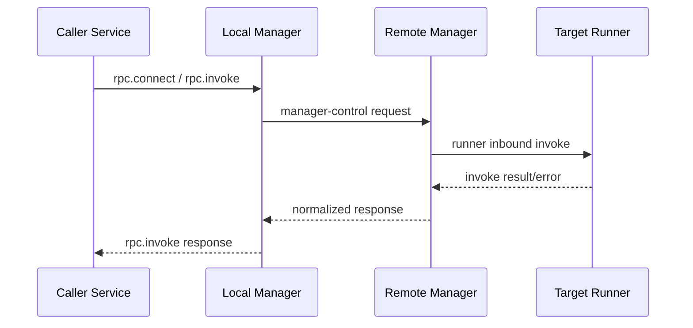

# Network RPC

Network RPC unifies local and remote service invocation through manager control paths.
The caller never talks directly to remote runner internals.

## Invocation Path

## Service Contract

- RPC-exposed services are configured as `type = "rpc"`.
- Runner startup in RPC mode is resident; function execution starts on `rpc.invoke`.
- Invocation payloads use protocol-defined CBOR fields.

## Authentication

- Daemon-side client keys are validated against allowlists.
- Known-host pinning protects remote manager identity checks.
- Certificate/key distribution helpers are available via bindings cert commands.

## Operational Notes

- Keep local and remote authority names stable.
- Use explicit target naming for predictable known-host lookups.
- Treat transport and permission failures as separate diagnosis tracks.

## Source References

- RPC payload contracts: [`crates/imago-protocol/src/messages/rpc.rs`](../crates/imago-protocol/src/messages/rpc.rs)
- Server protocol routing: [`crates/imagod-server/src/protocol_handler.rs`](../crates/imagod-server/src/protocol_handler.rs)
- Runtime invoke authorization: [`crates/imagod-control/src/service_supervisor.rs`](../crates/imagod-control/src/service_supervisor.rs)
- Runner startup behavior: [`crates/imagod-runtime/src/runner_process.rs`](../crates/imagod-runtime/src/runner_process.rs)
