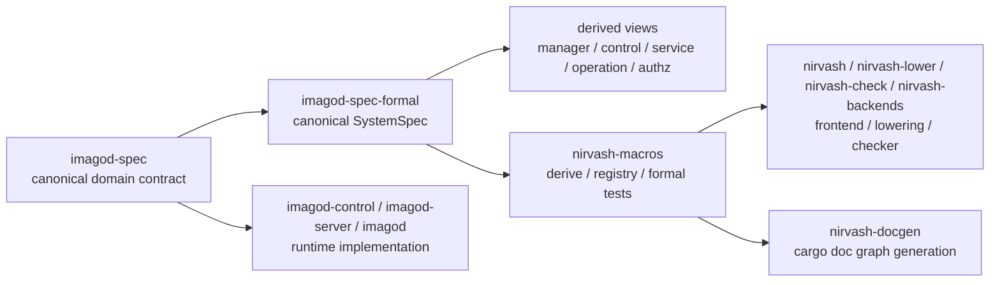

# nirvash と imagod の現状アーキテクチャ

このページは、`imagod` formal stack の source-of-truth を code/docs/test に対応する形で整理したものです。  
現行の正本は「shared contract」と「canonical system semantics」の 2 層です。

## 全体像

## 責務分離

- `crates/imagod-spec`
  - canonical domain contract
  - `identity` / `authorization` / `manager` / `service` / `operation` / `rpc` / `system`
  - `wire` / `messages` / `ipc` は adapter
- `crates/imagod-spec-formal`
  - canonical `SystemSpec`
  - `system.rs` が唯一の authored transition source
  - `manager_view` / `control_view` / `service_view` / `operation_view` / `authz_view` は derived projection
- `crates/imagod-control`, `crates/imagod-server`, `crates/imagod`
  - runtime 実装
  - この slice では formal crate へ直接合わせ込まない

## canonical system semantics

`imagod-spec-formal/src/system.rs` は daemon-visible event / milestone を `SystemEvent` として持ち、cross-domain causality を遷移そのもので表します。

- manager shutdown は session drain、service stop、maintenance stop、shutdown complete までを 1 本の lifecycle として持つ
- session/auth は message authorization の allow/deny と request state に接続する
- service lifecycle は command / local RPC / remote RPC eligibility に接続する
- binding grant と remote authority trust は system state の一部として保持される
- manager-auth proof は internal operation authorization の state fragment として保持される

つまり、manager action が service/control/operation を変える関係は invariant の後付けではなく、`SystemSpec` の transition として定義されます。

## derived views

derived view は独自 `transition_program()` を持ちません。  
それぞれ canonical `SystemState` を projection し、view-specific invariant を `SystemSpec` に重ねます。

- `manager_view`
  - manager phase / shutdown phase / maintenance projection
- `control_view`
  - active session / auth state / request state projection
- `service_view`
  - service lifecycle / binding projection
- `operation_view`
  - command slot / rpc outcome projection
- `authz_view`
  - message decision / operation decision projection

## backend 構成

`SystemSpec` は同一 state/action surface で explicit と symbolic の両 backend を使います。

- explicit case
  - multi-session / multi-service scenario
  - shutdown や remote RPC まで含めた広い reachable graph
- symbolic focus
  - 1 session / 1 service / 1 authority に action を絞った parity lane
  - AST-native transition program のまま symbolic snapshot を比較

## Source References

- canonical domain contract:
  - `crates/imagod-spec/src/identity.rs`
  - `crates/imagod-spec/src/authorization.rs`
  - `crates/imagod-spec/src/manager.rs`
  - `crates/imagod-spec/src/service.rs`
  - `crates/imagod-spec/src/operation.rs`
  - `crates/imagod-spec/src/rpc.rs`
  - `crates/imagod-spec/src/system.rs`
- formal system semantics:
  - `crates/imagod-spec-formal/src/system.rs`
  - `crates/imagod-spec-formal/src/manager_view.rs`
  - `crates/imagod-spec-formal/src/control_view.rs`
  - `crates/imagod-spec-formal/src/service_view.rs`
  - `crates/imagod-spec-formal/src/operation_view.rs`
  - `crates/imagod-spec-formal/src/authz_view.rs`
- checker/lowering:
  - `crates/nirvash/src/lib.rs`
  - `crates/nirvash-lower/src/lib.rs`
  - `crates/nirvash-check/src/lib.rs`
  - `crates/nirvash-backends/src/lib.rs`
