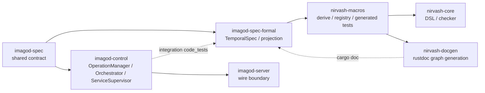
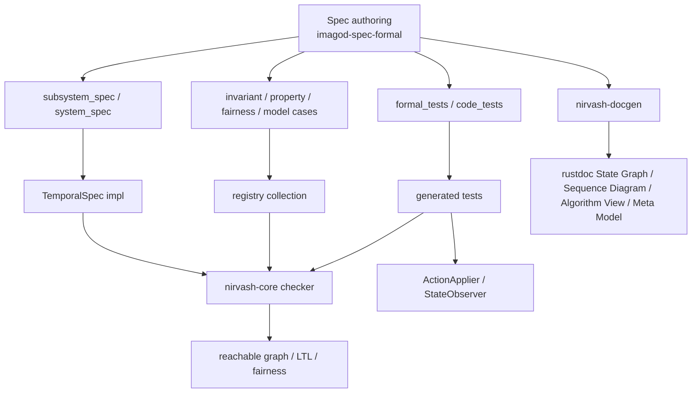
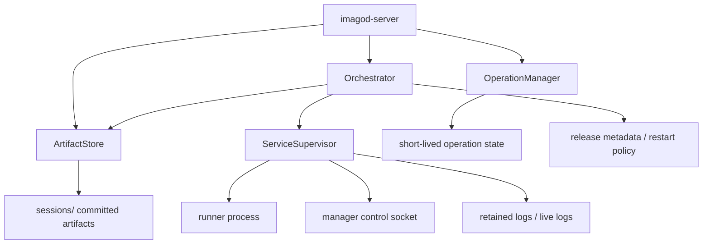
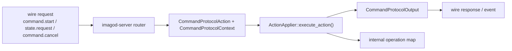
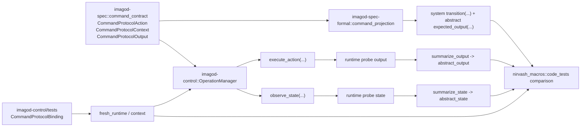

# nirvash と imagod-control の現状アーキテクチャ

このページは、現時点の `nirvash` と `imagod-control` の構成を、実装コードに対応する形で整理したものです。  
仕様の正本は引き続きコードとテストですが、ここでは「どの crate が何を担当し、どこで spec と実装が接続されるか」を俯瞰できるようにしています。

## 全体像

## nirvash のシステム

`nirvash` は、Rust DSL で書かれた spec をそのまま reachable graph ベースの形式検証と実コード conformance に接続する基盤です。

### 役割分担

- `crates/nirvash-core`
  - `Signature`、`TransitionSystem`、`TemporalSpec`
  - `RelAtom`、`RelSet`、`Relation2`、`RelationalState`
  - `Ltl`、`StatePredicate`、`StepPredicate`
  - `ModelChecker`
  - `conformance::{ActionApplier, StateObserver, ProtocolConformanceSpec, ProtocolRuntimeBinding}`
- `crates/nirvash-macros`
  - `#[derive(Signature)]`
  - `#[derive(RelAtom)]` / `#[derive(RelationalState)]`
  - `#[subsystem_spec]` / `#[system_spec]`
  - `#[formal_tests]` / `#[code_tests]`
  - `nirvash_projection_model!`
  - `#[nirvash_projection_contract]` (low-level fallback)
  - `#[derive(ProtocolInputWitness)]`
  - `#[invariant(...)]` などの registry 登録
- `crates/imagod-spec`
  - `command_contract` / `wire` / `ipc` の shared contract
- `crates/imago-protocol`
  - CBOR codec helper
- `crates/nirvash-docgen`
  - `cargo doc` 時に spec を走らせ、reachable graph と registration 情報から Mermaid 図を生成
- `crates/imagod-spec-formal`
  - `imagod` 全体の formal spec 記述
  - `command_protocol` では intended contract の projection つき conformance spec を実装
  - `system` は boot / session / wire / deploy / supervision / service RPC / plugin / shutdown を footprint-based concurrency で束ねる unified composition で、top-level では cross-link invariant と scenario model case を主に持つ
  - `legacy_system` は single-service 前提の旧 baseline として残す
- `crates/imagod-control/tests`
  - `command_protocol` の `OperationManager` runtime binding と `code_tests` 実行

### 構造図

### 重要な設計点

- 通常 spec の正本は `TransitionSystem::initial_states()`、`TransitionSystem::actions()`、`TransitionSystem::transition()` です。`system` のような並行 spec も top-level action を atomic に保った interleaving を正本にし、reachable graph 上の individual edge をそのまま検証します。
- `Signature` は helper enum/newtype や projection 型の bounded domain 付与にだけ使います。
- `imagod-spec-formal` では構造を持つ subsystem を relation-first で書くのを既定にし、atom を `RelAtom`、state field を `RelSet` / `Relation2` で持ちます。phase progression や terminal status のような線形 gate だけ scalar を残し、doc graph 側は relation schema と Alloy 風 notation を追加表示します。
- system-level の doc edge は atomic action をそのまま表示し、parallel 合成専用ラベルには依存しません。
- `nirvash-docgen` は `SpecVizBundle` を正本にして `Overview / Reachability / Scenario Traces / Process View / Data Model` を生成します。`Reachability` は reduced reachable graph を基本とし、大きい case では selected trace 由来の focus graph に自動フォールバックします。`Scenario Traces` は full reachable graph をそのまま線形化せず、`deadlock shortest path` / `focus predicate shortest path` / `cycle witness` / `happy path` を最大 4 本まで deterministic に選び、2 actor 以上なら Mermaid sequence、そうでなければ step table で描きます。`Process View` は actor/process metadata から loop block つきの疑似コードを出し、`Data Model` は relation schema / action vocabulary / 登録 constraint 群を 1 セクションへ集約します。Mermaid は state graph と selected trace sequence に限定し、全体モデルは text/table を正本にします。
- `formal_tests` は spec 単体を検査します。
- `code_tests` は `nirvash_core::conformance::ProtocolConformanceSpec` と `ProtocolRuntimeBinding` を使って grouped な runtime conformance を生成し、`ActionApplier` / `StateObserver` 経由で `before_probe -> summarize_state -> abstract_state`、`output_probe -> summarize_output -> abstract_output`、`after_probe -> summarize_state -> abstract_state` を比較します。runtime contract macro も同じ probe-first の流れを生成し、runtime 側には `observe_state(...) -> ProbeState` と `observe_output(...) -> ProbeOutput` だけを要求します。
- `code_witness_tests` は `ProtocolInputWitnessBinding` で positive / negative witness を受け取り、reachable graph から semantic case を自動検出して witness 単位の strict test を custom harness で列挙します。`Input = Action` 以外の witness は `#[derive(ProtocolInputWitness)]` で `ProtocolInputWitnessCodec<Action>` を自動実装し、`canonical_positive` / `positive_family` / `negative_family` / `witness_name(action, kind, index)` を既定生成します。runtime contract では `input_codec = ...` と `dispatch_input = ...` を組み合わせて generated family をそのまま replay できます。現行の command witness は `command_projection` が `system` から command surface を投影し、実行先は `OperationManager` に限定されます。ほかの boundary は grouped `code_tests` で `router_projection` / `session_auth_projection` / `logs_projection -> imagod-server`、`runtime_projection -> imagod-control`、`manager_runtime_projection -> imagod` に接続します。
- shared contract は `imagod-spec`、conformance API は `nirvash-core` にあり、formal spec 本体は `imagod-spec-formal`、runtime binding と `code_tests` 実行は runtime crate の integration test に置きます。

## imagod-control のシステム

`imagod-control` は manager 側の制御プレーンです。責務は大きく 4 つに分かれます。

- `ArtifactStore`
  - `deploy.prepare` / `artifact.push` / `artifact.commit`
  - upload session 管理、chunk 書き込み、digest/manifest 整合
- `OperationManager`
  - command start/cancel/state/remove 用の短命状態機械
  - `ActionApplier::execute_action(Context, Action) -> Output` の正式契約
- `Orchestrator`
  - deploy/run/stop の高位 orchestration
  - release 準備、manifest 検証、`ServiceSupervisor` への launch 指示
- `ServiceSupervisor`
  - runner process の spawn/ready/stop/log/control
  - manager-runner 制御ソケット、ログ保持、graceful stop

### 構造図

### command path

### release 時の設計上の注意

`OperationManager` の内部 state は formal 用の記憶を持ちません。  
現在の `OperationEntry` が保持するのは次だけです。

- `state`
- `stage`
- `updated_at_unix_secs`
- `cancel_requested`
- `phase`

つまり、conformance のために runtime 側へ `command_kind` や `last_error_kind` のような追加 field は戻していません。  
形式検証と実コード比較は、共有 contract と projection で行い、runtime 常駐 state は最小のまま保っています。

### command runtime 契約

`command_protocol` の runtime 側の正式 surface は、`OperationManager` の inherent method ではなく trait capability です。

- `ActionApplier::execute_action(&self, &CommandProtocolContext, &CommandProtocolAction) -> CommandProtocolOutput`
- `StateObserver::observe_state(&self, &CommandProtocolContext) -> CommandProtocolObservedState`

server はこの trait 契約をそのまま使って command action を適用します。  
`imagod-control` の integration test に置かれた `code_tests` も同じ trait 契約だけを前提に、reachable graph の prefix を実コードへ適用したうえで before/after probe を `summary -> abstract` へ射影して比較します。spec/runtime 間で「別の adapter API」を挟みません。
`command_projection` は binding-mode identity witness の例外で、`OperationManager` が既に formal 向け observed state/output を直接返せる前提を使います。その他の boundary は `probe -> summary -> abstract` を正本とし、runtime wrapper は concrete snapshot/event だけを probe として返し、projection spec 側の `ProbeState/ProbeOutput -> SummaryState/SummaryOutput -> AbstractState/ExpectedOutput` の写像を `nirvash_projection_model!` で宣言します。`probe_state_domain = ...` / `summary_output_domain = ...` を与えた projection では generated law test が bounded exhaustive に切り替わります。`#[nirvash_projection_contract]` は generated DSL では足りない特殊ケースの fallback です。現在は `router_projection` / `session_auth_projection` / `logs_projection` が `imagod-server`、`runtime_projection` が `imagod-control`、`manager_runtime_projection` が `imagod` に接続済みです。

## spec と runtime の接続

command runtime は、いま次の形で接続されています。

この接続で保証していることは次です。

- `system` の command projection 上で許可された action は、実コードでも受理される
- `system` の command projection で拒否される action は、実コードでも拒否される
- 実コードの summary state を `system` 側へ抽象化した結果が `transition` の next state と一致する
- 実コードの output summary を抽象化した結果が `expected_output` と一致する

`system` spec は、boot / session / wire / deploy / supervision / service RPC / plugin / shutdown を manager/session/trust/shutdown と束ねる unified top-level の正本です。  
full implementation の private state をそのまま複製するのではなく、daemon-visible contract と cross-link invariant を `system` に集約し、boundary ごとの runtime conformance は `*_projection` spec へ射影して接続します。`legacy_system` は boot / command / plugin を含む旧 synchronized baseline として残しています。

## Source References

- `nirvash-core`: `crates/nirvash-core/src/lib.rs`, `crates/nirvash-core/src/system.rs`, `crates/nirvash-core/src/checker.rs`, `crates/nirvash-core/src/concurrent.rs`
- `nirvash-macros`: `crates/nirvash-macros/src/lib.rs`
- `nirvash-docgen`: `crates/nirvash-docgen/src/lib.rs`
- shared contract: `crates/imagod-spec/src/command_contract.rs`, `crates/imagod-spec/src/wire.rs`, `crates/imagod-spec/src/ipc.rs`
- conformance API: `crates/nirvash-core/src/conformance.rs`
- `imagod-control`: `crates/imagod-control/src/lib.rs`, `crates/imagod-control/src/operation_state.rs`, `crates/imagod-control/src/artifact_store.rs`, `crates/imagod-control/src/orchestrator.rs`, `crates/imagod-control/src/service_supervisor.rs`
- spec 側接続: `crates/imagod-spec-formal/src/command_projection.rs`, `crates/imagod-spec-formal/src/router_projection.rs`, `crates/imagod-spec-formal/src/session_auth_projection.rs`, `crates/imagod-spec-formal/src/logs_projection.rs`, `crates/imagod-spec-formal/src/runtime_projection.rs`, `crates/imagod-spec-formal/src/manager_runtime_projection.rs`, `crates/imagod-spec-formal/src/command_protocol.rs`, `crates/imagod-spec-formal/src/deploy.rs`, `crates/imagod-spec-formal/src/supervision.rs`, `crates/imagod-spec-formal/src/rpc.rs`, `crates/imagod-spec-formal/src/session_auth.rs`, `crates/imagod-spec-formal/src/wire_protocol.rs`, `crates/imagod-spec-formal/src/system.rs`
- runtime 側 binding: `crates/imagod-control/tests/command_protocol_conformance.rs`, `crates/imagod-server/src/protocol_handler/router.rs`, `crates/imagod-server/src/protocol_handler/session_loop.rs`, `crates/imagod-server/src/protocol_handler/logs_forwarder.rs`, `crates/imagod-control/src/service_supervisor.rs`, `crates/imagod/src/manager_runtime.rs`
- wire boundary: `crates/imagod-server/src/protocol_handler/router.rs`
