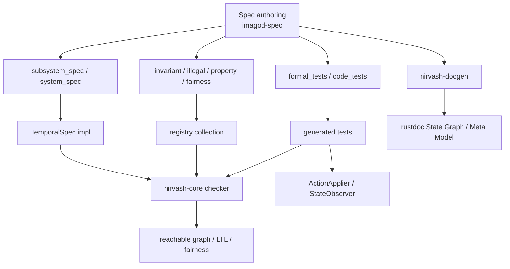
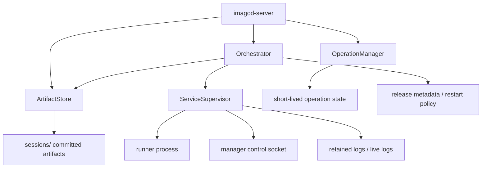
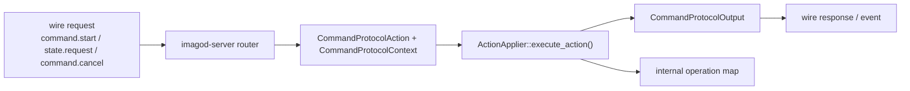
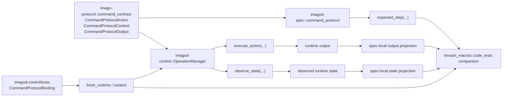

# nirvash と imagod-control の現状アーキテクチャ

このページは、現時点の `nirvash` と `imagod-control` の構成を、実装コードに対応する形で整理したものです。  
仕様の正本は引き続きコードとテストですが、ここでは「どの crate が何を担当し、どこで spec と実装が接続されるか」を俯瞰できるようにしています。

## 全体像

## nirvash のシステム

`nirvash` は、Rust DSL で書かれた spec をそのまま bounded な形式検証と実コード conformance に接続する基盤です。

### 役割分担

- `crates/nirvash-core`
  - `Signature`、`TransitionSystem`、`TemporalSpec`
  - `Ltl`、`StatePredicate`、`StepPredicate`
  - `ModelChecker`
  - `conformance::{ActionApplier, StateObserver, ProtocolConformanceSpec, ProtocolRuntimeBinding}`
- `crates/nirvash-macros`
  - `#[derive(Signature)]`
  - `#[subsystem_spec]` / `#[system_spec]`
  - `#[formal_tests]` / `#[code_tests]`
  - `#[invariant(...)]` などの registry 登録
- `crates/imago-protocol`
  - `command_contract` の shared contract
- `crates/nirvash-docgen`
  - `cargo doc` 時に spec を走らせ、reachable graph と registration 情報から Mermaid 図を生成
- `crates/imagod-spec`
  - `imagod` 全体の spec 記述
  - `command_protocol` では projection つきの conformance spec を実装
- `crates/imagod-control/tests`
  - `command_protocol` の runtime binding と `code_tests` 実行

### 構造図

### 重要な設計点

- spec は `State` / `Action` の bounded domain を持ちます。
- `formal_tests` は spec 単体を検査します。
- `code_tests` は `nirvash_core::conformance::ProtocolConformanceSpec` と `ProtocolRuntimeBinding` を使って runtime を生成し、`ActionApplier` / `StateObserver` 経由で spec の `expected_step` と比較します。
- shared contract は `imago-protocol`、conformance API は `nirvash-core` にあり、spec 本体は `imagod-spec`、runtime binding と `code_tests` 実行は runtime crate の integration test に置きます。

## imagod-control のシステム

`imagod-control` は manager 側の制御プレーンです。責務は大きく 4 つに分かれます。

- `ArtifactStore`
  - `deploy.prepare` / `artifact.push` / `artifact.commit`
  - upload session 管理、chunk 書き込み、digest/manifest 整合
- `OperationManager`
  - command start/cancel/state/remove 用の短命状態機械
  - `ActionApplier::execute_action(Context, Action) -> Output` の正式契約
- `Orchestrator`
  - deploy/run/stop の高位 orchestration
  - release 準備、manifest 検証、`ServiceSupervisor` への launch 指示
- `ServiceSupervisor`
  - runner process の spawn/ready/stop/log/control
  - manager-runner 制御ソケット、ログ保持、graceful stop

### 構造図

### command path

### release 時の設計上の注意

`OperationManager` の内部 state は formal 用の記憶を持ちません。  
現在の `OperationEntry` が保持するのは次だけです。

- `state`
- `stage`
- `updated_at_unix_secs`
- `cancel_requested`
- `phase`

つまり、conformance のために runtime 側へ `command_kind` や `last_error_kind` のような追加 field は戻していません。  
形式検証と実コード比較は、共有 contract と projection で行い、runtime 常駐 state は最小のまま保っています。

### command runtime 契約

`command_protocol` の runtime 側の正式 surface は、`OperationManager` の inherent method ではなく trait capability です。

- `ActionApplier::execute_action(&self, &CommandProtocolContext, &CommandProtocolAction) -> CommandProtocolOutput`
- `StateObserver::observe_state(&self, &CommandProtocolContext) -> CommandProtocolObservedState`

server はこの trait 契約をそのまま使って command action を適用します。  
`imagod-control` の integration test に置かれた `code_tests` も同じ trait 契約だけを前提に runtime を replay するため、spec/runtime 間で「別の adapter API」を挟みません。

## spec と runtime の接続

`command_protocol` は、いま次の形で接続されています。

この接続で保証していることは次です。

- spec の reachable graph 上で許可された action は、実コードでも受理される
- spec で拒否される action は、実コードでも拒否される
- 実コードの observed state を spec 側へ射影した結果が expected next state と一致する
- 実コードの output を spec 側へ射影した結果が expected output と一致する

## Source References

- `nirvash-core`: `crates/nirvash-core/src/lib.rs`, `crates/nirvash-core/src/system.rs`, `crates/nirvash-core/src/checker.rs`
- `nirvash-macros`: `crates/nirvash-macros/src/lib.rs`
- `nirvash-docgen`: `crates/nirvash-docgen/src/lib.rs`
- shared contract: `crates/imago-protocol/src/command_contract.rs`
- conformance API: `crates/nirvash-core/src/conformance.rs`
- `imagod-control`: `crates/imagod-control/src/lib.rs`, `crates/imagod-control/src/operation_state.rs`, `crates/imagod-control/src/artifact_store.rs`, `crates/imagod-control/src/orchestrator.rs`, `crates/imagod-control/src/service_supervisor.rs`
- spec 側接続: `crates/imagod-spec/src/command_protocol.rs`
- runtime 側 binding: `crates/imagod-control/tests/command_protocol_conformance.rs`
- wire boundary: `crates/imagod-server/src/protocol_handler/router.rs`
