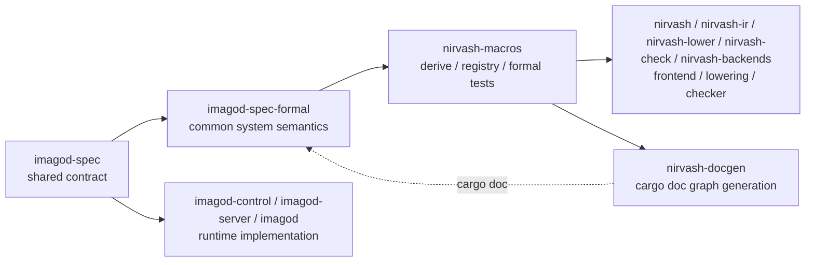

# nirvash と imagod の現状アーキテクチャ

このページは、現時点の `nirvash` と `imagod` formal stack の責務境界を、実装コードに対応する形で整理したものです。  
仕様の正本は引き続き code/docs/test ですが、ここでは「shared contract」「formal semantics」「runtime 実装」がどこで分かれているかに絞って説明します。

## 全体像

## 責務分離

- `crates/imagod-spec`
  - runtime が常時依存する shared contract
  - `command_contract` / `wire` / `ipc` / `messages` / `envelope` / `error` / `validate` だけを持つ
- `crates/imagod-spec-formal`
  - `imagod` の formal semantics 専用 crate
  - `manager_plane` / `control_plane` / `service_plane` / `operation_plane` / `system` を持つ
- `crates/imagod-control`, `crates/imagod-server`, `crates/imagod`
  - daemon / control-plane の runtime 実装
  - formal spec とは別責務として保持する

この再編では、`summary` / `probe` / `projection` / runtime conformance surface は `imagod-spec` と `imagod-spec-formal` から外しています。  
実コード検証は後続タスクとして分離し、formal crate 側は system semantics と model checking を正本にします。

## formal semantics

`imagod-spec-formal` は subsystem を 4 plane に再編しています。

- `manager_plane`
  - boot/config/listening/maintenance/shutdown/stopped を管理する phase machine
- `control_plane`
  - session accept/auth、request-response、log follow、authority upload を 1 daemon-visible event 単位で表す
- `service_plane`
  - artifact upload/commit/promote/rollback と service ready/running/stopping/reaped を 1 lifecycle に統合する
- `operation_plane`
  - command slot、binding、local RPC、remote RPC、remote authority 接続を表す

top-level の `system` は上の 4 plane を合成し、cross-plane invariant だけを追加します。

- listening 前は control / operation を受理しない
- promote されていない service は ready/running へ進めない
- binding と running service がない RPC は進めない
- shutdown 開始後は新規 accept/request/command/rpc を止め、service drain 完了後に stopped へ進む

## backend 構成

すべての plane と `system` は `transition_program()` を AST-native の直接 rule で持ちます。  
Rust helper dispatch や projection 経由の抽象化は使わず、`transition_program().successors()` / `transition_relation()` を正本にします。

`ModelInstance` は同一 spec 上で 2 lane を持ちます。

- `explicit_*`
  - 2 service / 2 session / 2 stream まで許す scenario case
  - reachable graph を主に使い、必要な liveness は bounded lasso を併用する
- `symbolic_*`
  - 同じ `State` / `Action` を使いながら、`state_constraint` / `action_constraint` で 1 active service / 1 active session / 1 active stream に絞る
  - AST-native に lowering できる focused case を symbolic backend で検証する

各 plane と `system` では `explicit_and_symbolic_backends_agree` を持ち、symbolic-safe case で parity を確認します。

## runtime との関係

runtime 実装は引き続き `imagod-control` / `imagod-server` / `imagod` にありますが、この段階では formal crate から直接接続しません。  
つまり、現行の formal stack は「shared contract を基底にした system semantics の正本」であり、runtime adapter や grouped conformance harness は含みません。

そのため、今回の source-of-truth は次の 2 つです。

- daemon-visible contract: `crates/imagod-spec`
- formal system semantics: `crates/imagod-spec-formal/src/system.rs` と各 plane spec

## Source References

- shared contract: `crates/imagod-spec/src/command_contract.rs`, `crates/imagod-spec/src/wire.rs`, `crates/imagod-spec/src/ipc.rs`
- formal semantics: `crates/imagod-spec-formal/src/atoms.rs`, `crates/imagod-spec-formal/src/bounds.rs`, `crates/imagod-spec-formal/src/manager_plane.rs`, `crates/imagod-spec-formal/src/control_plane.rs`, `crates/imagod-spec-formal/src/service_plane.rs`, `crates/imagod-spec-formal/src/operation_plane.rs`, `crates/imagod-spec-formal/src/system.rs`
- checker/lowering: `crates/nirvash/src/lib.rs`, `crates/nirvash-lower/src/lib.rs`, `crates/nirvash-check/src/lib.rs`, `crates/nirvash-backends/src/lib.rs`
- docgen/macros: `crates/nirvash-macros/src/lib.rs`, `crates/nirvash-docgen/src/lib.rs`
- runtime implementation: `crates/imagod-control/src/lib.rs`, `crates/imagod-server/src/lib.rs`, `crates/imagod/src/lib.rs`
