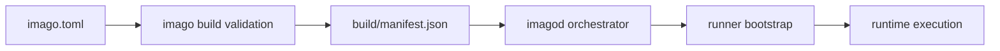

# Configuration Specification (`imago.toml` and `imagod.toml`)

## Purpose

This document defines the configuration contracts consumed by `imago-cli` and `imagod`.
Runtime behavior MUST match this document.

## Normalization Flow

## `imago.toml`

### Required keys

- `name`: service identifier. MUST be 1..63 chars and use ASCII `[A-Za-z0-9._-]`.
- `main`: relative component path. MUST exist at build time.
- `type`: MUST be one of `cli`, `http`, `socket`, `rpc`.
- `target.<name>.remote`: required for deploy/run/stop/logs/ps operations.

### Execution type rules

- `type=http` requires `[http]` and rejects `[socket]`.
- `type=socket` requires `[socket]` and rejects `[http]`.
- `type=rpc` is resident startup mode and executes functions through `rpc.invoke`.

### Target settings (`[target.<name>]`)

- `remote`: endpoint authority.
- `server_name`: optional authority override for known-host checks.
- `client_key`: required for authenticated remote operations.

### Build settings (`[build]`)

- `build.command` MAY be a string or string array.
- When omitted, `imago build` performs validation and manifest generation without command execution.

### WASI settings (`[wasi]`)

- `args`: string array.
- `env`: string map.
- `http_outbound`: string array of host, host:port, or CIDR entries.
- `mounts` and `read_only_mounts`: each entry MUST define `asset_dir` and absolute `guest_path`.

### Capability settings (`[capabilities]`)

- Default behavior is deny-by-default.
- `privileged=true` grants full access.
- `deps` controls dependency function permissions.
- `wasi` controls WASI interface/function permissions.

### Bindings and dependencies

- `[[bindings]]` defines service call permissions and MUST use `file://`, `warg://`, or `oci://` WIT sources.
- `[[dependencies]]` defines plugin dependencies with `kind = "native" | "wasm"`.
- `imago update` MUST resolve dependencies and produce lock/cache state consumed by build/deploy.

### Restart policy

- Top-level `restart` values: `never`, `on-failure`, `always`, `unless-stopped`.
- Default is `never`.
- Boot restore currently applies to `always` entries.

## `imagod.toml`

### Top-level keys

- `listen_addr`: server bind address.
- `storage_root`: artifact/runtime storage root.
- `server_version`: reported by `hello.negotiate`.
- `compatibility_date`: protocol compatibility key.

### TLS keys (`[tls]`)

- `server_key`: required private key path.
- `admin_public_keys`: optional admin key allowlist.
- `client_public_keys`: client key allowlist.
- `known_public_keys`: authority-to-key map for pinned peers.

### Runtime keys (`[runtime]`)

- Transfer limits: `chunk_size`, `max_inflight_chunks`, `max_artifact_size_bytes`, `upload_session_ttl_secs`.
- Process control: `stop_grace_timeout_secs`, `runner_ready_timeout_secs`.
- Logging/loop config: `runner_log_buffer_bytes`, `epoch_tick_interval_ms`.
- Ingress/session limits: `http_worker_count`, `http_worker_queue_capacity`, `max_concurrent_sessions`.
- Transport timeouts: `deploy_stream_timeout_secs`, `transport_keepalive_interval_secs`, `transport_max_idle_timeout_secs`.
- Boot toggles: `boot_plugin_gc_enabled`, `boot_restore_enabled`.

## Validation Requirements

- Unknown legacy keys MUST be rejected where explicitly unsupported.
- Required keys MUST produce hard validation errors when missing.
- Type constraints and range constraints MUST be enforced before runtime execution.
- Lock/cache mismatches for dependency resolution MUST fail with remediation guidance (`imago update`).

## Related Specifications

- [Manifest Specification](./manifest.md)
- [Deploy Protocol Specification](./deploy-protocol.md)
- [imagod Server Specification](./imagod.md)
