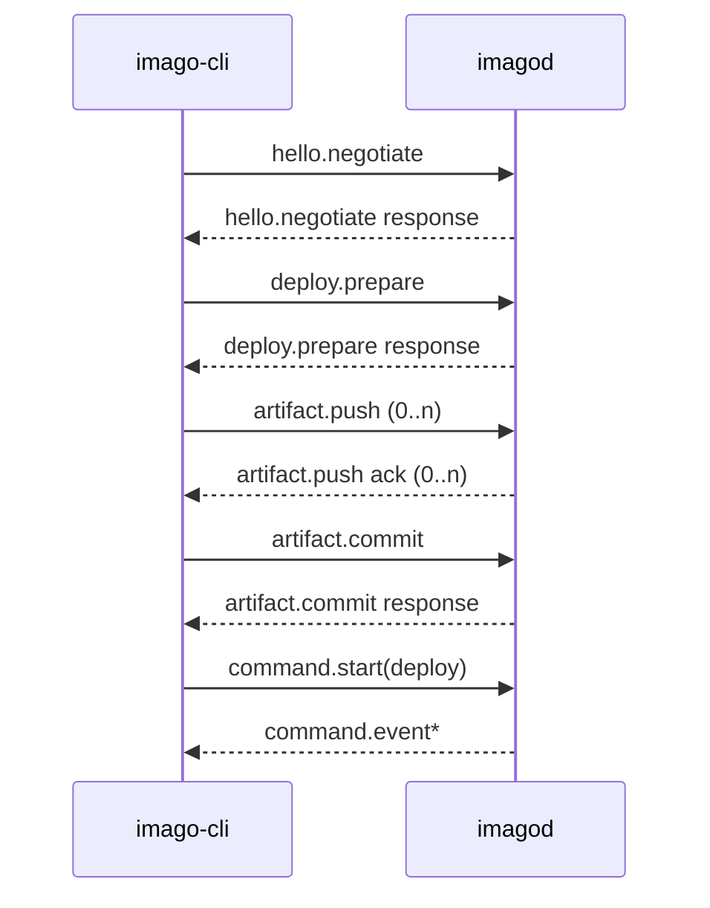

# Deploy Protocol Specification

## Purpose

This document defines wire-level contracts between `imago-cli` and `imagod` for deploy, run, stop, state, logs, and RPC operations.

## Transport

- QUIC + WebTransport
- CBOR payloads
- RPK-based authentication with host key pinning

## Framing

Stream messages use length-prefixed framing:

- 4-byte big-endian length
- CBOR payload bytes

A request stream MUST carry one request envelope.

## Core Envelope

`ProtocolEnvelope` fields:

- `type`
- `request_id`
- `correlation_id`
- `payload`
- `error` (optional)

`request_id` and `correlation_id` MUST be non-nil UUIDs.

## Deploy Sequence

## Run/Stop Sequence

- `hello.negotiate`
- `command.start(run|stop)`
- `command.event*` until terminal event

## Message Contracts

### `hello.negotiate`

Request includes compatibility key, client version, and required features.
Response includes acceptance flag, server version, feature list, and transfer/runtime limits.

### `deploy.prepare`

Request includes service identity, artifact metadata, manifest digest, and idempotency key.
Response includes deploy session id, artifact status, missing ranges, upload token, and expiration.

### `artifact.push`

Chunk transfers MUST respect negotiated `chunk_size` and in-flight limits.
Server responses report accepted ranges and progress state.

### `artifact.commit`

Final verification binds deploy session to committed artifact identity.

### `command.start`

- Command types: `deploy`, `run`, `stop`
- Payload MUST match command type.
- `request_id` in payload and envelope MUST match.

### `command.event`

Event types: `accepted`, `progress`, `succeeded`, `failed`, `canceled`.
`failed` events MUST include structured error.

### `state.request` / `state.response`

`state.response` reports only in-flight states.
Terminal states are returned via command events, not state snapshots.

### `command.cancel`

Cancellation is best-effort and scoped to in-flight commands.

### `logs.request` / `logs.chunk` / `logs.end`

- Request is sent on stream.
- Log chunks are sent via DATAGRAM.
- Sequence numbers are for loss detection only.

### `rpc.invoke`

Request includes target service, interface id, function, and CBOR args.
Response is either `result_cbor` or structured invoke error.

### `services.list`

Returns runtime/deployed service status snapshots and optional `names` filtering.

## Error Model

`StructuredError` fields:

- `code`
- `message`
- `retryable`
- `stage`
- `details`

Representative error codes include unauthorized, bad request, not found, timeout, and storage quota failures.

## Defaults

Default transfer/runtime limits are negotiated by server policy and exposed via `hello.negotiate` limits.

## Related Specifications

- [Configuration Specification](./config.md)
- [Manifest Specification](./manifest.md)
- [Observability Specification](./observability.md)
- [imago-protocol Specification](./imago-protocol.md)
