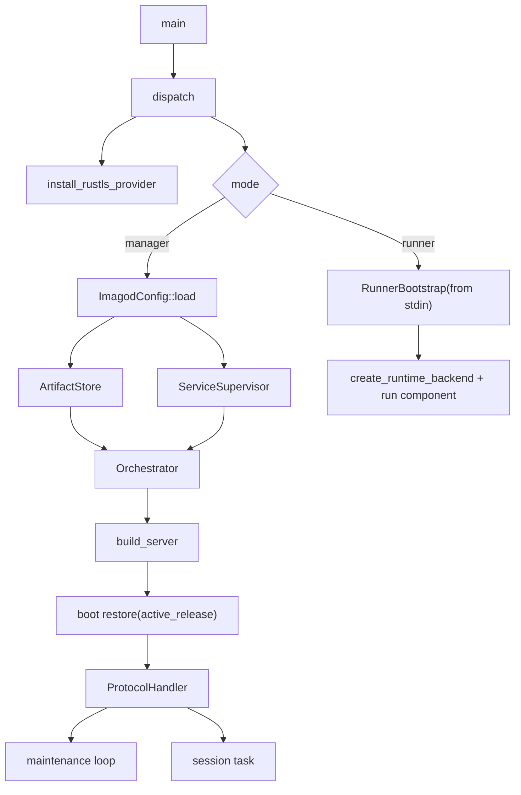
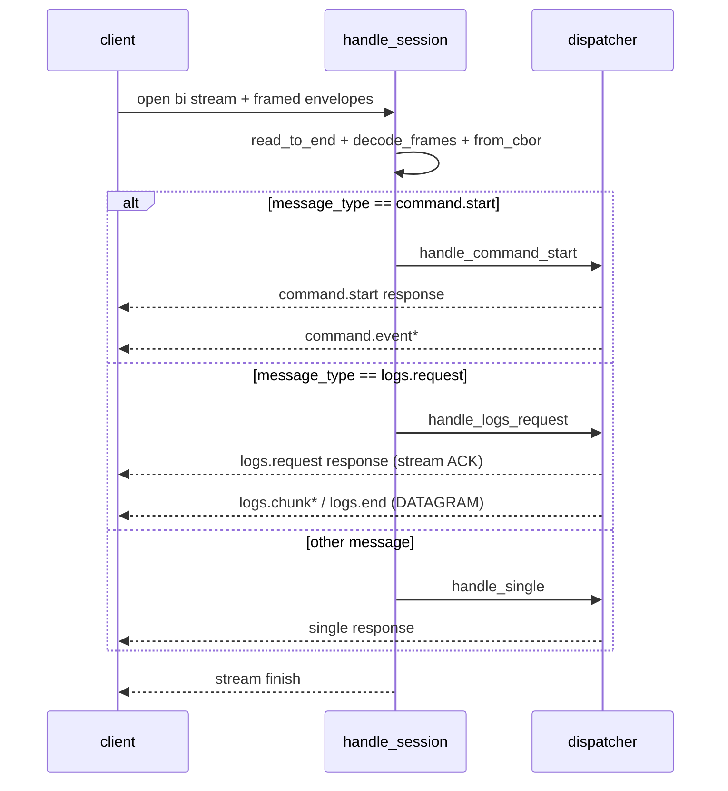
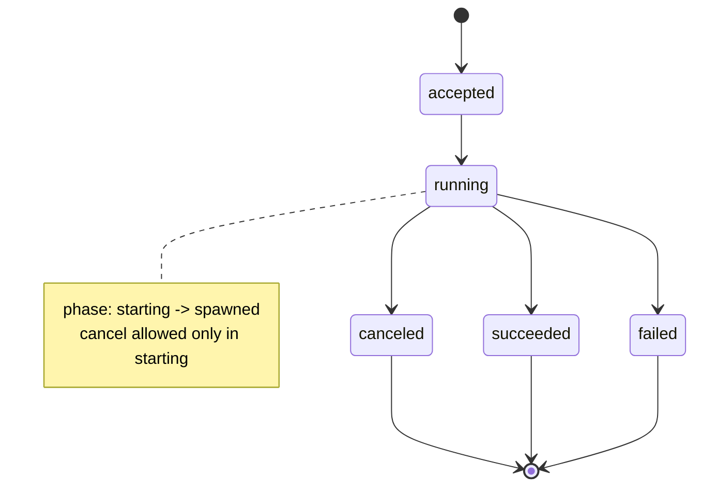
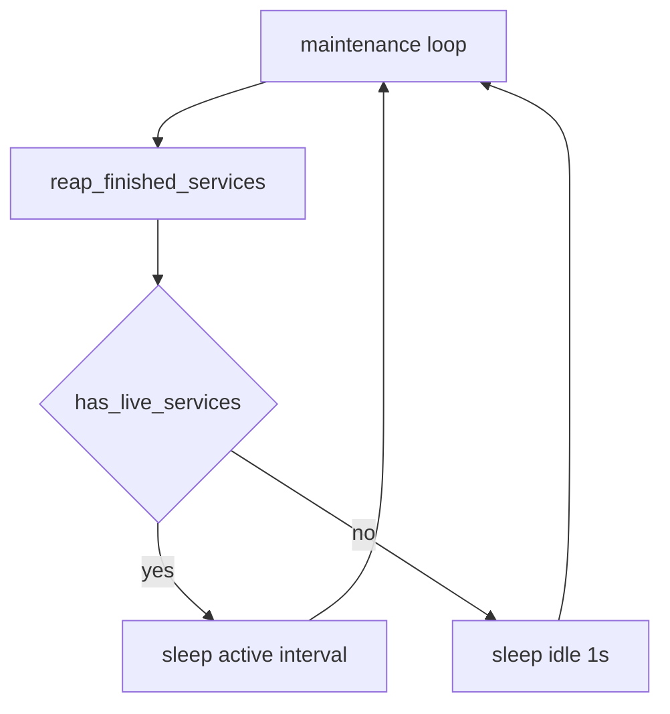

# imagod Internal Architecture Reference

この文書は `imagod` の内部実装を、実装者と運用者が同じ前提で追える粒度で記述する。

- 対象コード: `crates/imagod/src/main.rs` + `crates/imagod-*/src/*`
- 概要仕様: [`imagod.md`](./imagod.md)
- 関連仕様: [`deploy-protocol.md`](./deploy-protocol.md), [`observability.md`](./observability.md), [`imago-protocol.md`](./imago-protocol.md)

## 1. Scope / 読み方

対象読者: 実装者, 運用者

- 本文書は現行コードの責務分割とデータフローを示す。
- 仕様意図ではなく、どのモジュールが何を処理するかを主軸にする。
- コード断片の引用は最小限とし、`ファイル + 関数名` 参照で追跡する。

対象外:

- restart policy の高度化
- event 永続化/再送

## 2. プロセス起動とランタイム初期化

対象読者: 実装者, 運用者

実行起点は `crates/imagod/src/main.rs` の `main` / `dispatch`。

初期化順序:

1. `install_rustls_provider`
2. CLI 解析（`manager` / `--runner`）
3. manager モード:
4. `resolve_config_path` + `ImagodConfig::load`
5. `ArtifactStore::new`
6. `OperationManager::new`
7. `ServiceSupervisor::new`（manager control socket 起動）
8. `Orchestrator::new`
9. `build_server` で WebTransport サーバ構築
10. `Orchestrator::gc_unused_plugin_components_on_boot`（active release 未参照の plugin component cache を削除）
11. `Orchestrator::restore_active_services_on_boot`（`restart_policy=always` かつ `active_release` を持つ service を best-effort で自動復元）
12. `ProtocolHandler::new`
13. maintenance loop 起動
14. `accept` ループで session task を `tokio::spawn`
15. runner モード:
16. stdin から `RunnerBootstrap` を読込
17. `create_runtime_backend`（`runtime-wasmtime` 有効時は `WasmRuntime::new_with_native_plugins`） + component 実行

## 3. モジュール責務マップ

対象読者: 実装者

| モジュール | 主責務 | 主な入力 | 主な出力 | 依存方向 |
|---|---|---|---|---|
| `imagod-config (lib.rs)` | `imagod.toml` 読込・検証 | 設定パス | `ImagodConfig` | `imagod-common`, `imago-protocol` |
| `imagod-server::transport` | RPK + QUIC/WebTransport endpoint 構築（0-RTT 無効） | TLS 設定, listen_addr | `web_transport_quinn::Server` | `imagod-config`, `imagod-common` |
| `imagod-server::protocol_handler` | `ProtocolEnvelope<Value>` dispatch | bi-stream bytes | response envelope / command.event / logs datagram | `imagod-control`, `imagod-config` |
| `imagod-control::artifact_store` | upload session 管理、chunk commit、GC | prepare/push/commit | prepare/ack/commit response | `imagod-common` |
| `imagod-control::orchestrator` | deploy/run/stop の実行調停 | command payload | summary / error | `artifact_store`, `service_supervisor` |
| `imagod-control::service_supervisor` | runner child process 監督、control plane | `ServiceLaunch`, logs request | start/stop/replace/reap/open_logs | `imagod-ipc` |
| `imagod-runtime::runner_process` | runner モード実行（bootstrap, heartbeat, invoke受信） | `RunnerBootstrap` | run result / inbound response | `imagod-runtime-internal`, `imagod-runtime-wasmtime(feature)`, `imagod-ipc` |
| `imagod-runtime-internal` | runtime trait/共通 request-response 型 | app_type, path, env/http request | runtime 抽象 API | `imagod-common`, `imagod-ipc` |
| `imagod-runtime-wasmtime` | Wasmtime backend 実装（component model） | `RuntimeRunRequest`, `RuntimeHttpRequest` | `Result<()>`, `RuntimeHttpResponse` | `imagod-runtime-internal`, `wasmtime*` |
| `imagod-ipc::ipc/*` | manager-runner/runner-runner IPC 抽象 + 実装 | control/invoke message | response/token | `imagod-common` |
| `imagod-control::operation_state` | 短命 operation 状態管理 | UUID + state | `StateResponse`, cancel 判定 | `imagod-common` |
| `imagod-common (lib.rs)` | 内部エラーの構造化 | stage, message, code | `StructuredError` | `imago-protocol` |
| `imagod (main.rs)` | wiring と maintenance 制御 | config | process lifecycle | 全 internal crate |

## 4. 通信処理モデル

対象読者: 実装者, 運用者

通信入口は `crates/imagod-server/src/protocol_handler.rs` の `handle_session`。

処理モデル:

- session ごとに `accept_bi` ループを回し、受理した stream は session 内で task 並列処理する。
- stream 受信は `read_to_end` を 30 秒 timeout 付きで実行し、timeout 時は `E_OPERATION_TIMEOUT` で stream を閉じる。
- stream 受信バイトは `decode_frames` でフレーム分解し、各 frame を `from_cbor::<ProtocolEnvelope<Value>>` で復号。
- request envelope は 1 stream につき 1 件のみ許可。複数 request は `E_BAD_REQUEST`。
- `MessageType::CommandStart` は `handle_command_start` へ分岐し、同一 stream へ `command.start response` + `command.event*` を連続送信。
- `MessageType::LogsRequest` は stream で ACK を返した後、`Session::send_datagram` で `logs.chunk*` / `logs.end` を送信する。
- それ以外は `handle_single` で 1 request -> 1 response。

## 5. `command.start` 詳細フロー

対象読者: 実装者, 運用者

実装箇所: `crates/imagod-server/src/protocol_handler.rs` `handle_command_start`

共通処理:

1. `CommandStartRequest` decode + `Validate`
2. envelope `request_id` と payload `request_id` の一致検証（一致しない場合 `E_BAD_REQUEST`）
3. `OperationManager::start`
4. `CommandStartResponse { accepted: true }` 送信
5. `accepted` event 送信
6. `set_state(running, "starting")`
7. `progress(stage="starting")` 送信
8. `mark_spawned_if_not_canceled` で cancel フラグ確認と phase 遷移を原子的に実行

コマンド分岐:

- `deploy` -> `Orchestrator::deploy`
- `run` -> `Orchestrator::run`
- `stop` -> `Orchestrator::stop`

成功時:

- `progress`（詳細 stage）
- `succeeded`
- `finish(succeeded, success_stage)`
- `remove(request_id)`

失敗時:

- `failed(error=StructuredError)`
- `finish(failed, "failed")`
- `remove(request_id)`

spawn 遷移前 cancel 成立時:

- `canceled`
- `finish(canceled, "canceled")`
- `remove(request_id)`
- `mark_spawned_if_not_canceled` の cancel 分岐は terminal state を直接設定せず、イベント送信後に終端化する

## 6. ArtifactStore 詳細

対象読者: 実装者, 運用者

実装箇所: `crates/imagod-control/src/artifact_store.rs`

### 6.1 データモデル

- `StoreState.sessions: BTreeMap<String, UploadSession>`
- `StoreState.idempotency: BTreeMap<String, String>`
- `UploadSession` 主要項目:
  - `service_name`
  - `idempotency_key`
  - `artifact_digest`, `manifest_digest`, `artifact_size`
  - `upload_token`
  - `received_ranges`
  - `committed`
  - `inflight_writes`
  - `commit_in_progress`
  - `updated_at_epoch_secs`
  - `file_path`

- `ArtifactStore` 追加制約パラメータ:
  - `max_chunk_size`
  - `max_inflight_chunks`
  - `max_artifact_size_bytes`

### 6.2 不変条件

- `prepare`: `artifact_size > 0`
- `prepare`: `artifact_size <= max_artifact_size_bytes`
- `prepare`: idempotency 判定は lock 内で行い、artifact ファイル作成 (`open`/`set_len`/`flush`) は lock 外で行う
- `prepare`: lock 外 I/O 後に lock を再取得して最終挿入し、競合時は作成済みファイルを cleanup plan で削除
- `push`: `upload_token` 一致、range 妥当、`length <= max_chunk_size`、chunk hash 一致
- `push`: decode 前に `chunk_b64` encoded 長を検証し、`header.length` 由来上限を超える入力を拒否
- `push`: `inflight_writes < max_inflight_chunks`（超過時 `E_BUSY`）
- `commit`: metadata 一致、`inflight_writes == 0`、必要 range 完了、digest 一致
- `committed_artifact`: `committed=true` の session のみ返却
- `build_prepare_response`: partial 時の `missing_ranges` は欠損レンジ全件を列挙して返す

### 6.3 GC / 保持方針

- 入口 GC: `prepare` / `push` / `commit` / `committed_artifact`
- TTL 超過の未完了 session を削除（`inflight_writes > 0` / `commit_in_progress` は除外）
- 同一 service の旧コミット artifact/session/idempotency を削除し、最新のみ保持
- lock 内は削除対象の計画生成のみ、実ファイル削除は lock 外で実行
- `prepare` / `push` / `commit` は lock を分割し、ファイル I/O と digest 計算を lock 外で実施

## 7. Orchestrator 詳細

対象読者: 実装者, 運用者

実装箇所: `crates/imagod-control/src/orchestrator.rs`

主要経路:

- `deploy(payload)`
  - `prepare_release`
  - `supervisor.replace`
  - 成功時 `active_release` 更新
  - 失敗時 `auto_rollback=true` なら rollback 実行
- `run(payload)`
  - `active_release` 読込
  - release の `manifest.json` 再読込
  - `supervisor.start`
- `restore_active_services_on_boot()`
  - `services/<name>/restart_policy` と `services/<name>/active_release` を走査
  - `restart_policy=always` の service のみ対象
  - service 名昇順で逐次起動
  - service 単位の失敗を集計し、他 service の復元を継続（best-effort）
- `stop(payload)`
  - `supervisor.stop`

deploy 経路の要点:

- staging 展開
- manifest/hash 検証
- `manifest.name` は `[A-Za-z0-9._-]` のみ許可し、path separator/traversal を拒否
- `manifest.main` は相対パスのみ許可し、絶対/`..`/Windows prefix を拒否
- `manifest.dependencies(kind=wasm)` は `component.sha256` を検証し、`storage_root/plugins/components/<sha256>.wasm` へ配置（同 hash 再利用）
- release ID は `sha256(artifact_digest文字列)` の 64 hex を採用（16桁切り詰めはしない）
- `expected_current_release` は CAS で検証（`any` は比較スキップ、不一致は `E_PRECONDITION_FAILED`）
- `restart_policy` は `never` / `on-failure` / `always` / `unless-stopped` を受理し、未知値は `E_BAD_REQUEST`
- deploy 成功時に `services/<name>/restart_policy` を更新する
- manager 起動時の復元対象は `restart_policy=always` の service のみ
- manager 起動時に active release 参照集合を元に plugin component cache GC を実行
- `services/<name>/<release_hash>/` 配置
- 旧 release cleanup
- release 配置は `staging -> release` を安全な swap で実施し、失敗時は backup から復元する
- supervisor 起動置換

## 8. ServiceSupervisor 詳細

対象読者: 実装者, 運用者

実装箇所: `crates/imagod-control/src/service_supervisor.rs`

内部状態:

- `RwLock<BTreeMap<String, RunningService>>`
- `RunningService`:
  - `release_hash`
  - `started_at`
  - `status`
  - `runner_id`
  - `runner_endpoint`
  - `manager_auth_secret`
  - `invocation_secret`
  - `bindings`
  - `child`（`tokio::process::Child`）
  - `stdout/stderr` ring buffer
  - `last_heartbeat_at`
- manager control endpoint:
  - `runtime/ipc/manager-control.sock`
- pending readiness:
  - `pending_ready[runner_id] -> oneshot sender`

主要 API:

- `start`
- `replace`
- `stop(force)`
- `reap_finished`
- `has_live_services`

停止ポリシー:

- `force=false`: `shutdown_runner`（IPC）-> grace timeout 待機 -> 必要なら kill
- `force=true`: 即 kill
- `stop` は待機中に `stopping_count` を加算し、`has_live_services` が false にならないようにする

起動ポリシー:

- `start` は `imagod --runner` を `spawn+exec` し、stdin で `RunnerBootstrap` を渡す
- `start` は spawn 後すぐ成功返却せず、`runner_ready_timeout_secs` 以内の `runner_ready` を待つ
- timeout / ready 前終了時は起動失敗として child を回収し、deploy 側で rollback 経路へ入れる

## 9. Runtime backend 実行詳細

対象読者: 実装者

実装箇所:

- facade: `crates/imagod-runtime/src/runner_process.rs`, `crates/imagod-runtime/src/lib.rs`
- runtime trait: `crates/imagod-runtime-internal/src/lib.rs`
- Wasmtime backend: `crates/imagod-runtime-wasmtime/src/lib.rs`

backend 選択:

- `imagod-runtime` は feature `runtime-wasmtime`（default ON）で backend を有効化する。
- runner は `create_runtime_backend()` で backend を生成する。
- runner bootstrap には `plugin_dependencies` / `capabilities` が含まれ、runtime bridge の認可入力として利用する。
- feature OFF 時は runner 起動時に `E_INTERNAL` / `stage=runner.process` で明示的に失敗する。

設定:

- `Config::wasm_component_model(true)`
- `Config::async_support(true)`
- `Config::epoch_interruption(true)`

実行:

- runner は `RunnerBootstrap.app_type` を runtime へ渡し、`type` ごとに実行分岐する。
  - `cli`: `wasmtime_wasi::p2::bindings::Command::instantiate_async` + `call_run(...).await`
  - `http`: `wasmtime_wasi_http::bindings::Proxy::instantiate_async`（`incoming-handler` instantiate）後、runner の外部 ingress から `call_handle(...)` を都度実行
  - `socket`: `cli` 分岐と同じ `wasi:cli/run` を実行しつつ、`socket` 設定に基づいて `WasiCtxBuilder` の socket policy を構成する
- `cli` 分岐では `wasmtime_wasi::p2::add_to_linker_async` を利用する
- `http` 分岐では `wasmtime_wasi_http::add_only_http_to_linker_async` を併用する
- native plugin は `NativePlugin` trait と `NativePluginRegistryBuilder` で明示登録する。
  - descriptor（package/import/symbol/add_to_linker）は `imago-plugin-macros` が WIT から生成する。
  - plugin 実装本体は workspace 直下 `plugins/*` crate で管理する（初期実装は `plugins/imago-admin`）。
  - `kind=native` dependency が registry 未登録なら起動時に明示エラーで停止する。
- native plugin `imago:admin@0.1.0` は `wasmtime::component::bindgen!` 生成の `add_to_linker` で登録する。
  - import 名は `imago:admin/runtime@0.1.0`。
  - 提供関数は `service-name` / `release-hash` / `runner-id` / `app-type` の 4 つ。
  - 値は `RunnerBootstrap`（`service_name` / `release_hash` / `runner_id` / `app_type`）から供給する。
  - 関数呼び出し前の capability 判定は既存 `capabilities.deps` を利用する。
- `Store::set_epoch_deadline(1)`
- `Store::epoch_deadline_async_yield_and_update(1)`

socket policy:

- `socket.protocol` に応じて `allow_udp` / `allow_tcp` を切り替える。
- `socket.direction` と `socket.listen_addr:listen_port` を `socket_addr_check` に適用する。
  - inbound (`TcpBind` / `UdpBind`) は `listen_addr:listen_port` 完全一致時のみ許可。
  - outbound (`TcpConnect` / `UdpConnect` / `UdpOutgoingDatagram`) は `direction` が outbound を許可する場合のみ許可。
- `type=cli` / `type=http` は従来どおりネットワーク deny-by-default（`socket_addr_check=false`）を維持する。

HTTP ingress:

- `app_type=http` の runner は `127.0.0.1:http_port`（manifest 明示値）へ TCP bind する。
- `app_type=http` の ingress は keep-alive を無効化し、1 接続 1 リクエストで接続を閉じる。
- ingress 接続には idle timeout（既定 30 秒）を設け、無通信接続による handler 枯渇を防ぐ。
- ingress は `http_max_body_bytes`（未指定時 8MiB）を上限に request body を読み取る。
- ingress は HTTP/1.1 リクエストを受理し、`RuntimeHttpRequest` へ変換して runtime trait の `handle_http_request` を呼ぶ。
- runtime は `incoming-handler.handle` を呼び、返却された status/header/body を `RuntimeHttpResponse` に正規化して返す。
- bind 失敗は `runner_ready` 送信前に start 失敗として扱う。
- `type=http` の `runner_ready` は runtime 側の HTTP 初期化完了通知と ingress bind 成功の両方を満たした後に送信する。
- ingress のエラー応答本文は汎用文言（`bad request` / `internal server error`）のみ返し、詳細は runner ログへ出力する。

停止連携:

- `watch::Receiver<bool>` の shutdown signal と run future を `tokio::select!` で競合実行
- runner 内の epoch tick task が `epoch_tick_interval_ms` 周期で `Engine::increment_epoch()` を呼び、停止時の割り込み余地を維持する
- HTTP backend は worker task が `Store`/`Proxy` を専有し、`handle_http_request` は channel 経由で処理を委譲する（`Mutex` を `.await` 越しに保持しない）。

## 10. 状態管理と cancel セマンティクス

対象読者: 実装者, 運用者

実装箇所: `crates/imagod-control/src/operation_state.rs`

状態モデル:

- `CommandState`: `accepted`, `running`, `succeeded`, `failed`, `canceled`
- `OperationPhase`: `starting` / `spawned`

cancel 境界:

- `starting` かつ `mark_spawned_if_not_canceled` 実行前のみ cancel 可能
- `spawned` 以降は cancel 不可

終端後:

- `protocol_handler` が terminal event 送信後に `remove(request_id)` 実行
- 以後 `state.request` / `command.cancel` は `E_NOT_FOUND`

## 11. エラーモデル

対象読者: 実装者, 運用者

実装箇所: `crates/imagod-common/src/lib.rs`

`ImagodError` 主要項目:

- `code: ErrorCode`
- `stage: String`
- `message: String`
- `retryable: bool`
- `details`

`to_structured()` で `imago_protocol::StructuredError` へ変換して wire に載せる。

代表 stage:

- `config.load`
- `transport.setup`
- `deploy.prepare`
- `artifact.push`
- `artifact.commit`
- `orchestration`
- `runtime.start`
- `command.start`

## 12. 並行性・メモリ・CPU特性

対象読者: 実装者, 運用者

共有状態:

- `ArtifactStore`: `tokio::Mutex`
- `OperationManager`: `tokio::RwLock`
- `ServiceSupervisor`: `tokio::RwLock`

バックグラウンドタスク:

- session task（session ごとに spawn）
- maintenance loop（単一）
  - `reap_finished_services`
  - live service あり: active interval sleep
  - live service なし: idle 1 秒 sleep
  - shutdown signal を await 境界（reap/has_live/sleep）で優先確認し、停止遅延を抑制
  - shutdown 後は maintenance task の join を待機し、30秒 timeout 超過時は process をエラー終了
- manager control server（単一）
  - `register_runner` / `runner_ready` / `heartbeat` / `resolve_invocation_target`
- runner process 内 task
  - inbound server（`shutdown_runner` / `invoke`）
  - heartbeat sender
  - epoch tick task（`increment_epoch`）

増加抑制:

- operation: terminal 後に削除
- artifact: TTL GC + 同名旧コミット削除 + orphan idempotency 清掃

## 13. 運用観点

対象読者: 運用者

主要ログ観点:

- 起動: listen addr
- session 異常: stream read/write エラー
- service 異常終了: supervisor の join 結果
- artifact cleanup 異常

典型トラブル起点:

- 接続不可: server/client 鍵設定や `known_hosts` 不整合
- deploy 失敗: digest/manifest 不一致
- `E_NOT_FOUND`: 終端後照会の可能性
- `E_BUSY`: 同名 service 競合

## 14. 既知の制約・将来拡張

対象読者: 実装者, 運用者

既知制約:

- service の実行中状態は in-memory（再起動で消える）。ただし `restart_policy=always` かつ `active_release` を持つ service は起動時に自動復元する
- upload session index も in-memory（再起動跨ぎ継続なし）
- `state.request` は短命 operation のみ
- event 永続化/再送なし

拡張候補:

- restart policy/backoff 追加
- artifact index 永続化
- 長期 service 状態照会 API

## 実装反映ノート（RPK + TOFU / 2026-02-18）

- [BREAKING] transport 初期化は `tls.server_cert` / `tls.client_ca_cert` 読み込みをやめ、`tls.server_key` と `tls.client_public_keys` を正本にする。
- server 側のクライアント認可は `client_public_keys` の静的 allowlist で判定する。
- client 側のサーバ認証は `known_hosts` による pin を前提とし、初回接続時のみ TOFU 登録を許可する。

## 実装参照インデックス

- 起動/配線: `crates/imagod/src/main.rs`
- 設定: `crates/imagod-config/src/lib.rs`
- transport: `crates/imagod-server/src/transport.rs`
- protocol handler: `crates/imagod-server/src/protocol_handler.rs`
- artifact store: `crates/imagod-control/src/artifact_store.rs`
- orchestrator: `crates/imagod-control/src/orchestrator.rs`
- service supervisor: `crates/imagod-control/src/service_supervisor.rs`
- runner process: `crates/imagod-runtime/src/runner_process.rs`
- ipc transport: `crates/imagod-ipc/src/ipc/*`
- runtime trait: `crates/imagod-runtime-internal/src/lib.rs`
- runtime (wasmtime backend): `crates/imagod-runtime-wasmtime/src/lib.rs`
- operation state: `crates/imagod-control/src/operation_state.rs`
- error: `crates/imagod-common/src/lib.rs`

## 実装反映ノート（Multi-process Runner / 2026-02-11）

- Wasmtime 実行主体を manager process から runner process へ移行した。
  - `main.rs` は `manager` / `--runner` の2モードで起動する。
  - runner は stdin で受け取る `RunnerBootstrap`（CBOR）を使って初期化する。
- `ServiceSupervisor` は task 監督から child process 監督へ変更した。
  - `tokio::process::Command` で `imagod --runner` を起動する。
  - `start` は `runner_ready_timeout_secs` 内に `runner_ready` を受信するまで待機する。
  - `stop(force=false)` は `shutdown_runner` 要求（IPC）→ grace timeout → kill fallback。
- IPC は `ipc` モジュールに抽象化した。
  - trait: `ControlPlaneTransport`, `InvocationTransport`
  - 実装: `DbusP2pTransport`（UDS 上の frame + CBOR）
  - manager-runner 制御: `register_runner`, `runner_ready`, `shutdown_runner`, `heartbeat`, `resolve_invocation_target`
  - `shutdown_runner` は `manager_auth_proof` を必須とし、runner 側で照合する。
- runner 間 direct invoke の基盤を追加した（実関数実行は未実装）。
  - `resolve_invocation_target` は `manifest.bindings` を用いた interface 単位 ACL を適用する。
  - manager は target runner 秘密鍵で短命 token を発行し、callee runner が検証する。
- runner bootstrap に `app_type`（`cli` / `http` / `socket`）を追加した。
  - runner process は Wasmtime 直結ではなく runtime trait 経由で実行し、将来の runtime 差し替え可能性を確保する。
- runner bootstrap に `http_port`（`type=http` 時のみ有効）を追加した。
  - orchestrator は manifest の `http.port` を `ServiceLaunch` / `RunnerBootstrap` へ伝播する。
  - runner は `127.0.0.1:http_port` へ ingress bind し、`incoming-handler.handle` を実行する。
- runner bootstrap に `http_max_body_bytes`（`type=http` 時のみ有効）を追加した。
  - orchestrator は manifest の `http.max_body_bytes` を `ServiceLaunch` / `RunnerBootstrap` へ伝播する。
  - runner は未指定時 8MiB を既定値として扱う。
- ログ回収を追加した。
  - runner stdout/stderr を pipe で manager が回収する。
  - service ごとに容量上限付き ring buffer（`runner_log_buffer_bytes`）へ保持する。
- epoch 割り込みの駆動点を変更した。
  - 旧: manager の maintenance loop で `increment_epoch`
  - 新: runner 内で `epoch_tick_interval_ms` 周期の tick task が `increment_epoch`

## 実装反映ノート（Runner 起動確認窓と socket cleanup / 2026-02-11）

- runner 起動時に固定 200ms の起動確認窓を導入した。
  - manager への `runner_ready` 通知前に、Wasm 実行タスクの早期終了を監視する。
- 起動確認窓内に Wasm 実行が `Err` で終了した場合、`runner_ready` を送信せず start 失敗として扱う。
- 互換維持のため、起動確認窓内に Wasm 実行が `Ok(())` で終了した場合は成功扱いを維持する。
- runner endpoint socket の削除を RAII で保証した。
  - 正常終了だけでなく `register_runner` / `runner_ready` 失敗などの早期 return 経路でも socket を自動クリーンアップする。

## 実装反映ノート（Crate Split 6+1 / 2026-02-11）

- `imagod` の内部実装を単一 crate から以下の 6+1 構成に分割した。
  - `imagod`（bin, 配線）
  - `imagod-common`
  - `imagod-config`
  - `imagod-ipc`
  - `imagod-runtime`
  - `imagod-control`
  - `imagod-server`
- バイナリ互換は維持し、起動方式（`imagod`, `imagod --runner`）は変更しない。
- deploy protocol の wire 契約は変更しない（内部実装のみの再編）。

## 実装反映ノート（Issue #31 / 2026-02-13）

- `protocol_handler` に `logs.request` 分岐を追加し、ログ本文を DATAGRAM 専用経路へ移行した。
- `service_supervisor` に `running_service_names` / `open_logs` を追加し、tail snapshot + follow 受信を提供する。
- 全サービス購読は `name=None` で受理し、リクエスト時点の running サービスのみを対象に固定した。

## 実装反映ノート（Runtime Backend Split / 2026-02-13）

- Wasmtime backend を `imagod-runtime` から `imagod-runtime-wasmtime` へ分離した。
- runtime trait/共通型を `imagod-runtime-internal` に集約し、runner は trait 経由で実行する。
- `imagod-runtime` に feature `runtime-wasmtime` を追加した（default ON）。
- `runtime-wasmtime` OFF 時は、runner が `E_INTERNAL` / `stage=runner.process` で「runtime backend 未有効」を返す。
- `imagod-runtime::WasmRuntime` は `runtime-wasmtime` 有効時のみ再exportを維持する。

## 実装反映ノート（Socket Runtime MVP / 2026-02-15）

- `type=socket` を runner/runtime 実装で有効化した。
  - `RunnerBootstrap.socket`（`protocol` / `direction` / `listen_addr` / `listen_port`）を追加し、manager から runner へ設定を伝播する。
  - Wasmtime backend は `app_type=socket` で `wasi:cli/run` 実行を継続しつつ、`WasiCtxBuilder` の socket policy (`allow_udp` / `allow_tcp` / `socket_addr_check`) を適用する。
- `type=socket` の manifest 検証を強化した。
  - `manifest.socket` は必須。
  - `listen_addr` は IP アドレスとして検証し、`listen_port` は `1..=65535` を要求する。
- `wasi-threads` は今回のスコープ外。
  - 現行 runtime は component 実行経路（`Component::from_file`）前提であり、`wasmtime-wasi-threads` の core module 実行経路統合は別 issue で扱う。

## 実装反映ノート（Boot Restore / 2026-02-14）

- manager 起動時に `Orchestrator::restore_active_services_on_boot` を実行する。
- `build_server` の初期化成功後に復元を開始し、listen 初期化失敗時の孤児ランナー発生を防ぐ。
- 復元対象は `storage_root/services/<service>/active_release` が存在し、非空文字列の service のみ。
- 復元は service 名昇順で逐次実行し、個別失敗は `RestoreFailure` として集計して継続する。
- manager は復元結果（成功/失敗/集計）をログ出力し、失敗があっても server 起動を継続する。

## 実装反映ノート（Issue #87 / 2026-02-15）

- `logs.request` のフィルタキーを `name` へ統一した。
- logs ACK の対象一覧キーを `names` へ統一した。

## 実装反映ノート（Manager/Session/Logs 改修 / 2026-02-18）

- `ServiceSupervisor::wait_for_runner_ready` は `tokio::select!` 中心の待機へ変更した。`runner_ready`、runner 早期終了、ready timeout を同時待ちする。
- manager control の request read timeout は runner ready timeout と分離し、`runtime.manager_control_read_timeout_ms`（既定 500ms）で設定する。
- manager control server は `accept` 後に handler permit を取得する順序へ変更し、permit の占有時間を短縮した。
- protocol session は 1 session 内の複数 bi-stream を並列処理する。
- logs datagram 送信は一時失敗時に 10ms / 50ms / 100ms の bounded retry を実施する。
