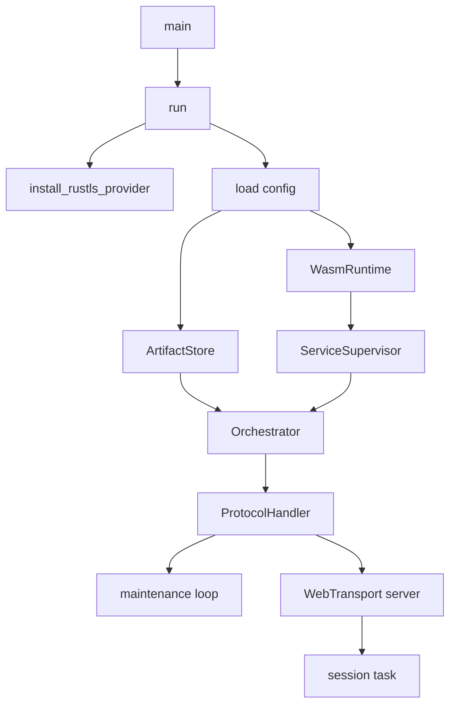
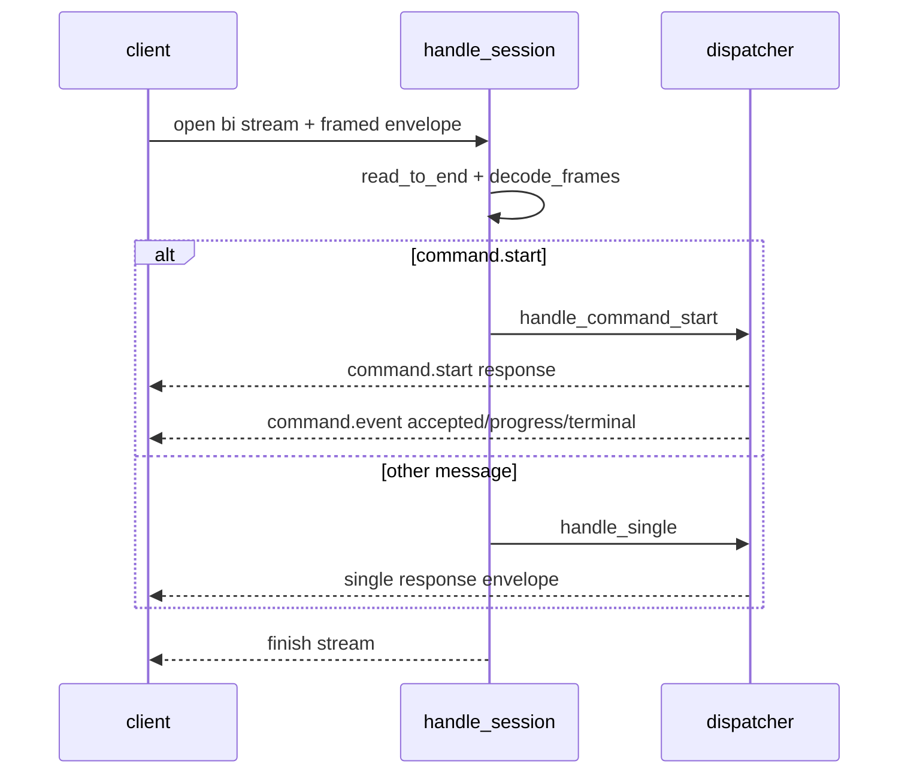
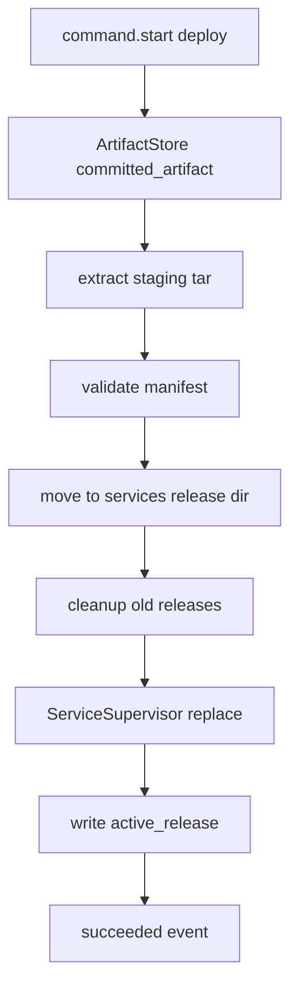
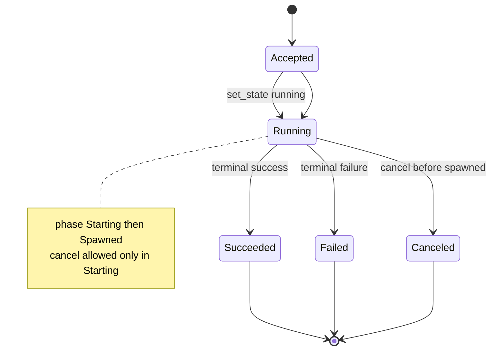
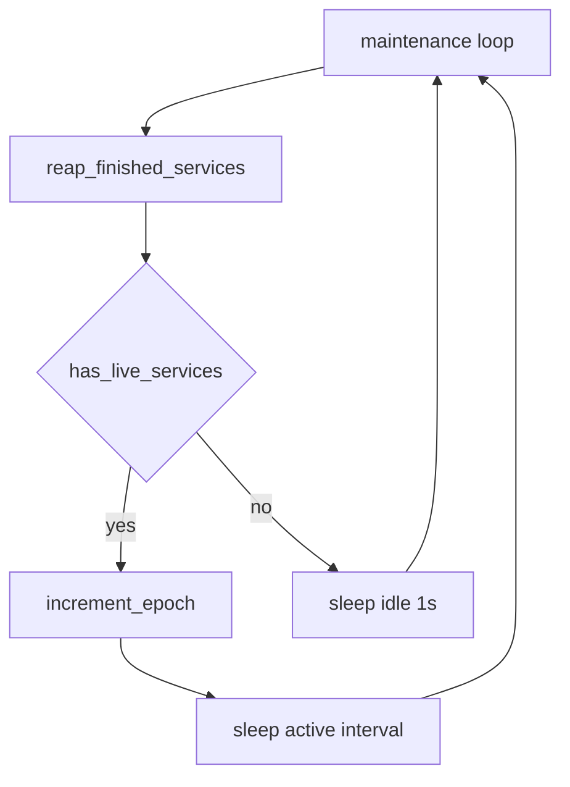

# imagod Internal Architecture Reference

この文書は `imagod` の内部実装を、実装者と運用者の双方が追跡できる粒度で記述する。

- 対象コード: `crates/imagod/src/*.rs`
- 関連仕様: [`imagod.md`](./imagod.md), [`deploy-protocol.md`](./deploy-protocol.md), [`observability.md`](./observability.md), [`config.md`](./config.md)

## 1. Scope / 読み方

対象読者: 実装者, 運用者

- この文書は「現行コードの構造」を説明する。
- 仕様の意図だけでなく、**どの関数がどの責務を持つか**を示す。
- コード引用は最小限にし、`ファイル + 関数名` で追跡する。

対象外:

- 将来の restart policy 高度化
- 再起動跨ぎの service 復元
- イベント永続化/再送

## 2. プロセス起動とランタイム初期化

対象読者: 実装者, 運用者

実行起点は `/Users/sizumita/.codex/worktrees/9f21/imago/crates/imagod/src/main.rs` の `main` / `run`。

初期化順序:

1. `install_rustls_provider`
2. `parse_config_arg` + `resolve_config_path` + `ImagodConfig::load`
3. `ArtifactStore::new(storage_root/artifacts, upload_session_ttl_secs)`
4. `OperationManager::new`
5. `WasmRuntime::new`
6. `ServiceSupervisor::new(runtime, stop_grace_timeout_secs)`
7. `Orchestrator::new(storage_root, artifact_store, supervisor)`
8. `ProtocolHandler::new(config, artifact_store, operation_manager, orchestrator)`
9. maintenance loop 起動
10. `build_server` で WebTransport サーバ構築
11. `accept` ループで各 session を `tokio::spawn`

## 3. モジュール責務マップ

対象読者: 実装者

| モジュール | 主責務 | 主な入力 | 主な出力 | 依存方向 |
|---|---|---|---|---|
| `config.rs` | `imagod.toml` 読込・検証 | ファイルパス | `ImagodConfig` | `error.rs`, `imago-protocol` |
| `transport.rs` | mTLS + QUIC/WebTransport endpoint 構築 | `ImagodConfig.tls`, `listen_addr` | `web_transport_quinn::Server` | `config.rs`, `error.rs` |
| `protocol_handler.rs` | メッセージ dispatch と command event 生成 | `Envelope` stream | `Envelope` response/event | `artifact_store`, `orchestrator`, `operation_state` |
| `artifact_store.rs` | upload session 管理、chunk commit、GC | `DeployPrepare/Push/Commit` | `DeployPrepareResponse` など | `error.rs` |
| `orchestrator.rs` | release 準備/配置/起動停止連携 | `Deploy/Run/Stop payload` | `DeploySummary` 等 | `artifact_store`, `service_supervisor` |
| `service_supervisor.rs` | バックグラウンド Wasm 実行管理 | `ServiceLaunch` | start/stop/reap 結果 | `runtime_wasmtime` |
| `runtime_wasmtime.rs` | Wasmtime async 実行 | component path + env | `Result<()>` | `error.rs` |
| `operation_state.rs` | command operation の短命状態管理 | request_id/state | `StateResponse`, `CommandCancelResponse` | `error.rs` |
| `error.rs` | 内部エラーの構造化 | `ErrorCode`, stage, message | `StructuredError` | `imago-protocol` |
| `main.rs` | wiring, maintenance loop, session task 起動 | config | process lifecycle | 全モジュール |

## 4. 通信処理モデル

対象読者: 実装者, 運用者

通信入口は `/Users/sizumita/.codex/worktrees/9f21/imago/crates/imagod/src/protocol_handler.rs` の `handle_session`。

基本モデル:

- 1 WebTransport session 内で `accept_bi` ループ。
- 1 bi-stream から `read_to_end` で受信し、`decode_frames` -> `Envelope` へ復号。
- `MESSAGE_COMMAND_START` のみ専用経路 `handle_command_start` で event を同 stream に返す。
- それ以外は `handle_single` で request/response 1往復。

## 5. `command.start` 詳細フロー

対象読者: 実装者, 運用者

実装箇所: `/Users/sizumita/.codex/worktrees/9f21/imago/crates/imagod/src/protocol_handler.rs` `handle_command_start`

共通処理:

1. `CommandStartRequest` decode
2. `OperationManager::start`
3. `accepted` response
4. `accepted` event
5. `set_state(running, starting)`
6. `progress(starting)` event
7. 早期 `cancel` チェック（spawn 前）

分岐:

- `deploy`: `Orchestrator::deploy`
- `run`: `Orchestrator::run`
- `stop`: `Orchestrator::stop`

成功時:

- `mark_spawned`
- `finish(succeeded, stage)`
- `progress(...)`
- `succeeded`
- `remove(request_id)`

失敗時:

- `finish(failed)`
- `failed`
- `remove(request_id)`

`cancel` 早期成立時:

- `finish(canceled)`
- `canceled`
- `remove(request_id)`

## 6. ArtifactStore 詳細

対象読者: 実装者, 運用者

実装箇所: `/Users/sizumita/.codex/worktrees/9f21/imago/crates/imagod/src/artifact_store.rs`

### 6.1 データモデル

- `StoreState.sessions: BTreeMap<deploy_id, UploadSession>`
- `StoreState.idempotency: BTreeMap<idempotency_key, deploy_id>`
- `UploadSession` 主要項目:
  - `service_name`
  - `idempotency_key`
  - `artifact_digest`, `manifest_digest`, `artifact_size`
  - `upload_token`
  - `received_ranges`
  - `committed`
  - `updated_at_epoch_secs`
  - `file_path` (`artifacts/sessions/<deploy_id>.artifact`)

### 6.2 不変条件

- `prepare` 時に `artifact_size > 0`
- `push` は `upload_token` 一致必須
- `push` は `chunk_sha256` 検証必須
- `commit` は metadata 一致 + range 完了 + 全体 digest 一致必須
- `committed_artifact` は `committed=true` の deploy のみ返却

### 6.3 GC と保持ポリシー

- GC は `prepare/push/commit/committed_artifact` の入口で実行。
- 未コミット session は `upload_session_ttl_secs` 超過で削除。
- `commit` 成功時、同一 `service_name` の旧コミット session/file を削除し、最新のみ保持。
- orphan `idempotency_key` も掃除。
- lock 中は `CleanupPlan` に削除対象を積み、実ファイル削除は lock 外で実施。

### 6.4 主要関数

- `collect_expired_sessions_locked`
- `collect_old_committed_sessions_locked`
- `collect_sessions_for_removal_locked`
- `cleanup_orphan_idempotency_locked`
- `apply_cleanup_plan`

## 7. Orchestrator 詳細

対象読者: 実装者, 運用者

実装箇所: `/Users/sizumita/.codex/worktrees/9f21/imago/crates/imagod/src/orchestrator.rs`

主経路:

- `deploy(payload)`
  - `prepare_release`
  - `supervisor.replace(launch)`
  - 成功時 `active_release` 更新
  - 失敗時 `auto_rollback` なら `rollback_previous_release`
- `run(payload)`
  - `services/<name>/active_release` 読込
  - release の `manifest.json` を再読込し `ServiceLaunch` 構築
  - `supervisor.start`
- `stop(payload)`
  - `supervisor.stop(name, force)`

release 操作:

- staging 展開 (`extract_tar`)
- manifest 検証 (`manifest.hash.targets`, digest 一致)
- `/services/<name>/<release_hash>/` へ移動
- `cleanup_old_releases` で不要ディレクトリ削除

## 8. ServiceSupervisor 詳細

対象読者: 実装者, 運用者

実装箇所: `/Users/sizumita/.codex/worktrees/9f21/imago/crates/imagod/src/service_supervisor.rs`

内部保持:

- `inner: RwLock<BTreeMap<service_name, RunningService>>`
- `RunningService`:
  - `release_hash`, `started_at`, `status`
  - `shutdown_tx` (`watch::Sender<bool>`)
  - `abort_handle`
  - `join_handle`

主要操作:

- `start`: 同名稼働確認 -> task spawn
- `replace`: `stop` -> `start`
- `stop(force=false)`: shutdown signal + timeout wait + 必要なら abort
- `stop(force=true)`: 即 abort
- `reap_finished`: 完了 task の join と map から削除
- `has_live_services`: `join_handle.is_finished()` で稼働判定

運用観点:

- 停止/異常終了は `log_join_outcome` で stderr に構造化ログ出力。

## 9. Wasmtime 実行詳細

対象読者: 実装者

実装箇所: `/Users/sizumita/.codex/worktrees/9f21/imago/crates/imagod/src/runtime_wasmtime.rs`

設定:

- `Config::wasm_component_model(true)`
- `Config::async_support(true)`
- `Config::epoch_interruption(true)`

実行:

- `add_to_linker_async`
- `Command::instantiate_async`
- `wasi_cli_run().call_run(...).await`
- `Store::set_epoch_deadline(1)`
- `Store::epoch_deadline_async_yield_and_update(1)`

停止連携:

- `watch::Receiver<bool>` を受け取り、`tokio::select!` で
  - shutdown signal
  - run future
  の早い方で完了。

## 10. 状態管理と cancel セマンティクス

対象読者: 実装者, 運用者

実装箇所: `/Users/sizumita/.codex/worktrees/9f21/imago/crates/imagod/src/operation_state.rs`

内部状態:

- `OperationState`: `Accepted | Running | Succeeded | Failed | Canceled`
- `OperationPhase`: `Starting | Spawned`

意味:

- `Starting`: spawn 前。`command.cancel` 可能。
- `Spawned`: spawn 後。`command.cancel` 不可 (`cancellable=false`)。

終端後:

- `protocol_handler` が terminal event 送信後に `remove(request_id)` を呼ぶ。
- 以後 `state.request` / `command.cancel` は `E_NOT_FOUND`。

## 11. エラーモデル

対象読者: 実装者, 運用者

実装箇所: `/Users/sizumita/.codex/worktrees/9f21/imago/crates/imagod/src/error.rs`

`ImagodError` フィールド:

- `code: ErrorCode`
- `stage: String`
- `message: String`
- `retryable: bool`
- `details: BTreeMap<String, serde_json::Value>`

変換:

- `to_structured()` で `imago_protocol::StructuredError` 化し、wire に載せる。

stage の代表例:

- `config.load`
- `transport.setup`
- `deploy.prepare` / `artifact.push` / `artifact.commit`
- `orchestration`
- `runtime.start`
- `command.start`

## 12. 並行性・メモリ・CPU特性

対象読者: 実装者, 運用者

共有状態:

- `ArtifactStore`: `tokio::Mutex<StoreState>`
- `OperationManager`: `tokio::RwLock<BTreeMap<...>>`
- `ServiceSupervisor`: `tokio::RwLock<BTreeMap<...>>`

バックグラウンドタスク:

- session ごと: `tokio::spawn`（`handle_session`）
- maintenance: 1本の無限ループ
  - `reap_finished_services`
  - live service あり: `increment_epoch` + active interval sleep
  - live service なし: idle 1秒 sleep

無限増加対策:

- operation: terminal 後 `remove`
- artifact: TTL GC + 同名旧コミット削除 + orphan idempotency 清掃

## 13. 運用観点

対象読者: 運用者

見るべきログ:

- 起動: `imagod listening on <addr>`
- session 異常: `session error: ...`
- service 終了/失敗: `service stopped ...`, `service failed ...`, `service task join error ...`
- artifact 掃除失敗: `artifact cleanup failed path=...`

トラブルシュート起点:

- 接続不可: `listen_addr` / TLS 証明書パス / mTLS CA
- deploy 失敗: `artifact.commit` の digest mismatch / manifest 不整合
- `E_NOT_FOUND`: operation 終端削除後に照会していないか確認
- `E_BUSY`: 既存同名 service 稼働中

## 14. 既知の制約・将来拡張

対象読者: 実装者, 運用者

既知の制約:

- `ServiceSupervisor` は in-memory 管理。`imagod` 再起動で service map は消える。
- artifact session も in-memory index 前提。再起動跨ぎ継続は未対応。
- `state.request` は短命 operation のみ。長期 service 稼働状態APIは未提供。
- event 永続化/再送は未対応。

将来拡張候補:

- 再起動時の service 自動復元（compose 的運用）
- restart policy の明示設定と backoff
- artifact index の永続化
- service 稼働状態の照会 API 追加

## 実装参照インデックス

- 起動/配線: `/Users/sizumita/.codex/worktrees/9f21/imago/crates/imagod/src/main.rs`
- 設定: `/Users/sizumita/.codex/worktrees/9f21/imago/crates/imagod/src/config.rs`
- transport: `/Users/sizumita/.codex/worktrees/9f21/imago/crates/imagod/src/transport.rs`
- protocol handler: `/Users/sizumita/.codex/worktrees/9f21/imago/crates/imagod/src/protocol_handler.rs`
- artifact store: `/Users/sizumita/.codex/worktrees/9f21/imago/crates/imagod/src/artifact_store.rs`
- orchestrator: `/Users/sizumita/.codex/worktrees/9f21/imago/crates/imagod/src/orchestrator.rs`
- service supervisor: `/Users/sizumita/.codex/worktrees/9f21/imago/crates/imagod/src/service_supervisor.rs`
- runtime: `/Users/sizumita/.codex/worktrees/9f21/imago/crates/imagod/src/runtime_wasmtime.rs`
- operation state: `/Users/sizumita/.codex/worktrees/9f21/imago/crates/imagod/src/operation_state.rs`
- error: `/Users/sizumita/.codex/worktrees/9f21/imago/crates/imagod/src/error.rs`
