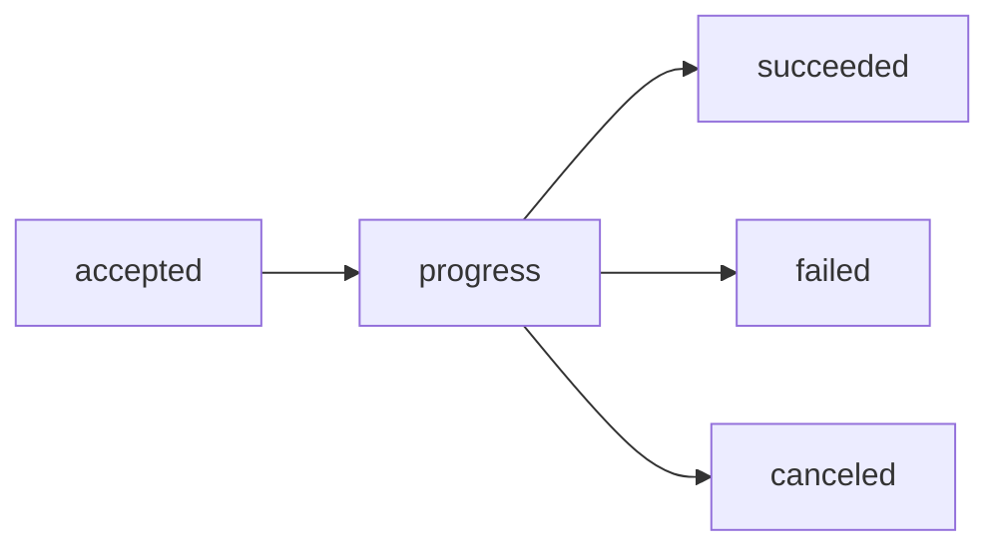
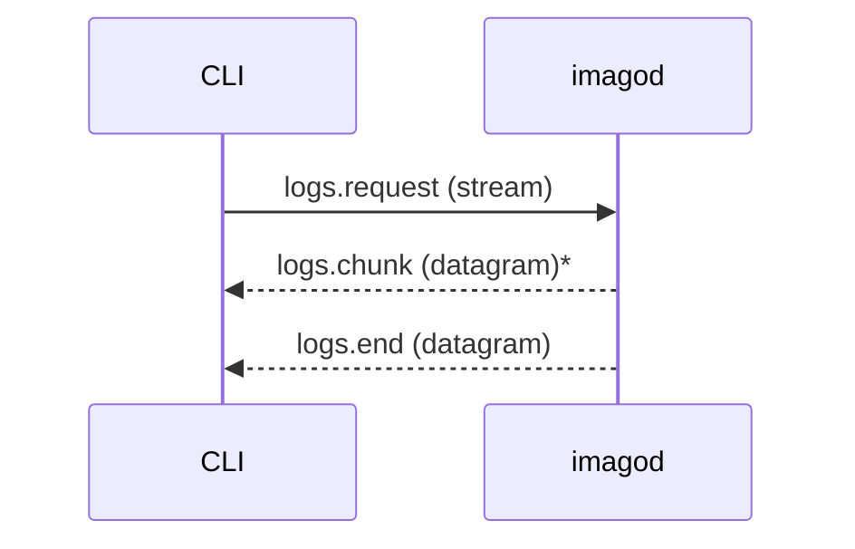

# Deploy Observability Specification

## Purpose

This document defines observable command lifecycle, status polling, and log streaming behavior.

## Identifiers

- `request_id`: operation identifier
- `correlation_id`: trace-level correlation across related messages

Both are UUID values from protocol envelopes.

## Command Lifecycle Events

`command.event` is the primary lifecycle stream.

Rules:

- `progress` events MUST include a non-empty `stage`.
- `failed` events MUST include structured error payload.
- terminal event MUST close lifecycle for the command request.

## State Polling

`state.request`/`state.response` provides in-flight snapshots.

- Response states MUST be non-terminal (`accepted` or `running`).
- Unknown/non-running request ids SHOULD return not-found structured errors.

## Service Listing

`services.list` returns service status snapshots.

- `names` filter is optional.
- Unknown names MUST NOT fail the request.
- `started_at` MAY be empty for stopped services.

## Logs Streaming

Rules:

- `logs.request` controls scope (`name`, `follow`, `tail`).
- `logs.chunk.seq` indicates ordering/loss detection only.
- No retransmission guarantee is provided for lost datagrams.
- Retained logs are in-memory and bounded.

## Cancellation Visibility

- `command.cancel` acknowledgments describe cancellability and final state snapshots.
- Canceled operations MUST publish terminal lifecycle events.

## Related Specifications

- [Deploy Protocol Specification](./deploy-protocol.md)
- [CLI Output Specification](./cli-output.md)
